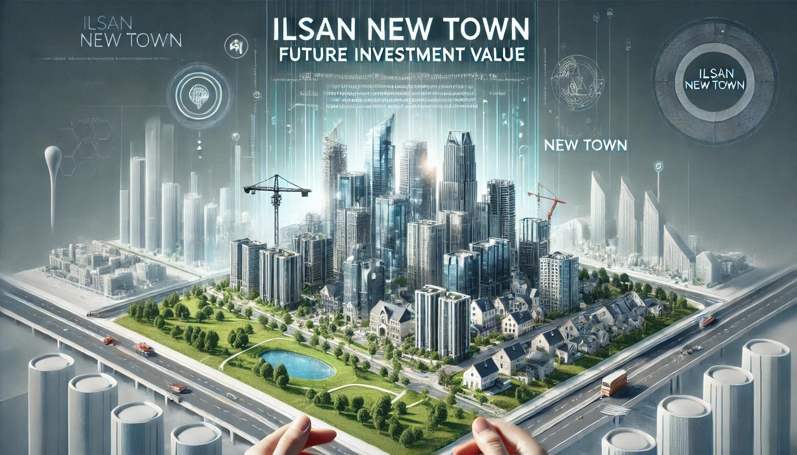

## 일산 신도시의 미래 투자 가치 탐색: 1차 신도시 재건축 지역과의 비교 분석
- 1989년 1기 신도시 건설 이후 형성된 부동산 가치 차이를 분석하여, 상대적으로 저평가된 일산 신도시의 투자 가치를 높일 방안을 탐구.
- 데이터 분석을 통해 주요 요인(아파트 실거래가, 일자리, 교통 접근성, 생활 인프라 등)이 투자 가치에 미치는 영향을 비교 및 예측.

## **핵심 분석 내용**
1. **아파트 실거래가 분석**
   - 2006~2024년 실거래 데이터를 기반으로 일산과 분당의 가격 변동 요인 분석.  
   - GTX-A 노선 등 정책 및 교통 호재의 영향을 평가.
2. **일자리 및 직주근접성**
   - 고용률, 실업률, 주요 직장 접근성을 분석해 부동산 가치와의 연관성 도출.
3. **교통 접근성**
   - 서울 주요 지역과의 거리, 교통 인프라(지하철, GTX 등) 영향 비교.
4. **생활 인프라**
   - 상가, 병원, 학교, 공원 등의 분포와 생활 편의성 분석을 통한 신도시별 효율성 평가.

## **종합 목표**
- 일산 신도시의 낮은 투자 가치를 개선하기 위한 주요 요인 도출 및 부동산 가치 상승 가능성 예측.

## **데이터 출처**
- 국토교통부, KOSIS, 고양시 및 성남시 사업체 조사 DB, 각종 공공데이터 포털.

## **팀원 역할**
- 주제 기획, 데이터 수집 및 분석, 결과 도출에 각 팀원이 역할을 나눠 진행.  

이 프로젝트는 데이터 기반의 실증적 접근으로 일산 신도시의 미래 가치를 재조명하려는 시도입니다.
