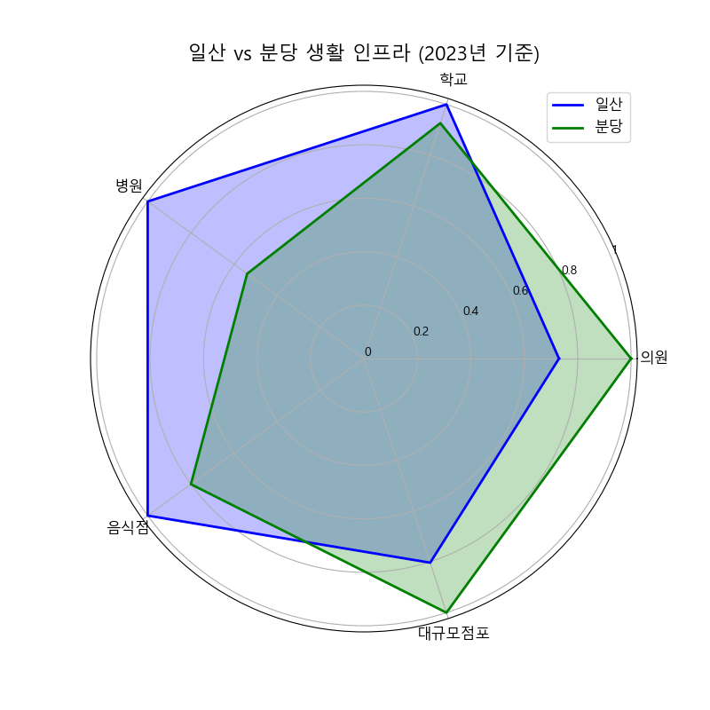
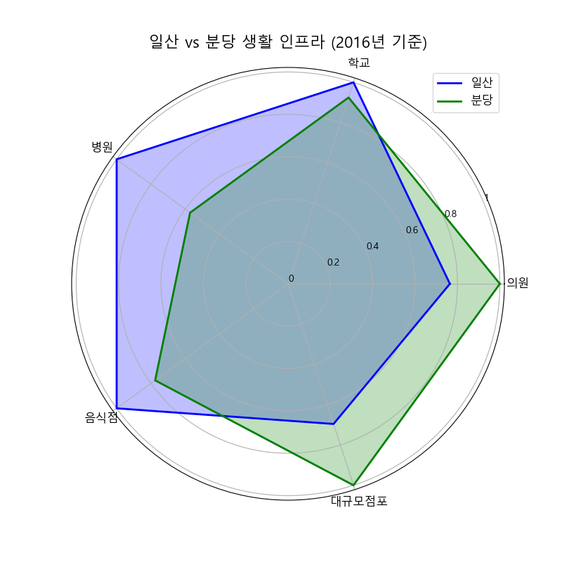
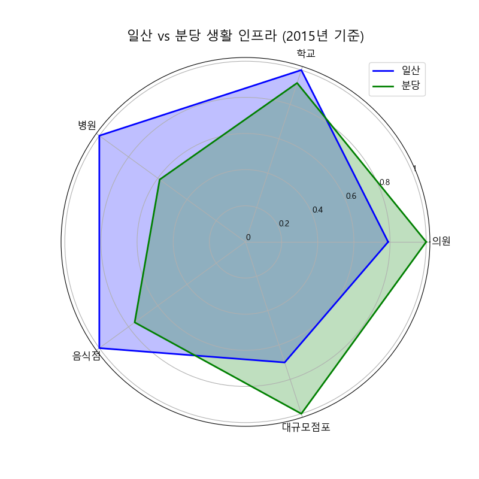
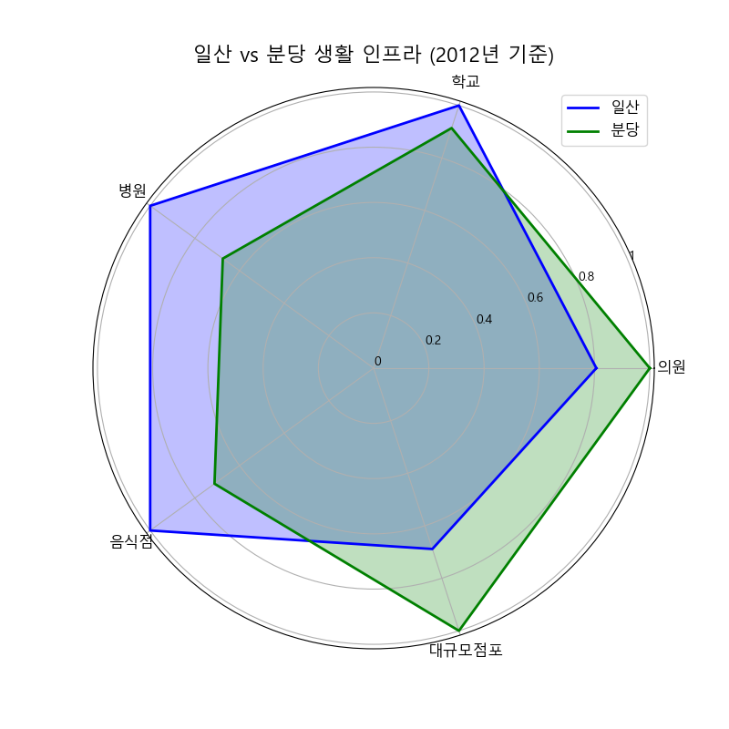
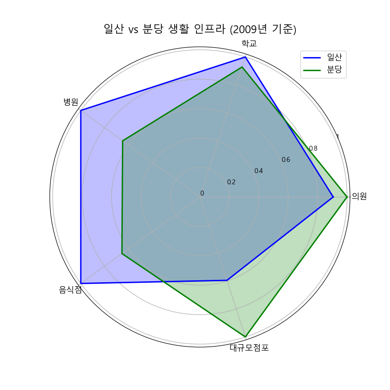
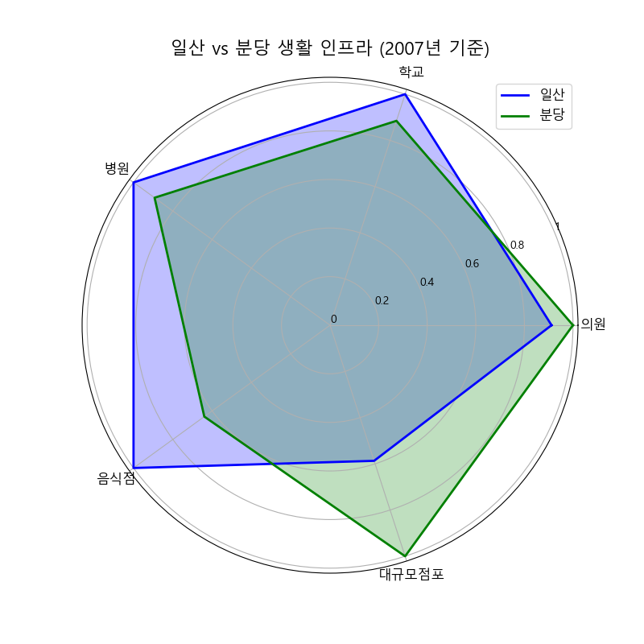

<<<<<<< HEAD
=======
<<<<<<< HEAD
<<<<<<< HEAD
<<<<<<< HEAD
# 생활 인프라 그래프

## 2024 11월 기준
=======
<<<<<<< HEAD
>>>>>>> f383b65 (update rader chart images)
=======
=======
=======
# 생활 인프라 그래프

## 2024 11월 기준
>>>>>>> 4cec626 (Modify : Delete confilcted word)
>>>>>>> 65df4d4 (Modify : Delete confilcted word)
>>>>>>> 95cb51a (Modify : Delete confilcted word)
## 데이터

=======
## 데이터

>>>>>>> 2124402 (update rader chart images)

시장 및 마트

## 진행방식
- 필터링 (1) : 주소가 빈값이 아닌경우에 대해 우선선택 (소재지도로명주소, 소재지지번주소)
- 필터링 (2) : 분당, 일산 단어가 포함된 위치 우선적으로 선택
- 필터링 (3) : 위도,경도가 모두 빈칸인 행 Search, 주소가 이상한 곳 제거

### 데이터 테이블 예시 (분당 / 89,5) / (일산 / 56,5)
| 시설구분명 | 소재지도로명주소                                              | 소재지지번주소                       | WGS84위도   | WGS84경도   |
|------------|---------------------------------------------------------------|---------------------------------------|-------------|-------------|
| 전통시장   | 경기도 성남시 분당구 불정로386번길 10 서현동 효자촌미래타운아파트 | 경기도 성남시 분당구 서현동 307      | 37.373416   | 127.138036  |
| 전통시장   | 경기도 성남시 분당구 불정로376번길 31                          | 경기도 성남시 분당구 서현동 311      | 37.372255   | 127.138871  |
| 전통시장   | 경기도 성남시 분당구 불정로376번길 37 서현동                   | 경기도 성남시 분당구 서현동 312-3    | 37.371629   | 127.139444  |
| 전통시장   | 경기도 성남시 분당구 내정로165번길 38                          | 경기도 성남시 분당구수내동 32        | 37.376661   | 127.116239  |
| 전통시장   | 경기도 성남시 분당구 내정로 165번길 38                         | 경기도 성남시 분당구 수내동 32       | 37.376661   | 127.116239  |

대규모 점포, 일반 음식점

## 진행방식
- 필터링 (1) : 주소가 빈값이 아닌경우에 대해 우선선택 (소재지도로명주소, 소재지지번주소)
- 필터링 (2) : 분당, 일산 단어가 포함된 위치 우선적으로 선택
- 전처리 (1) : 위도,경도가 모두 빈칸인 행 Search 후 API를 활용한 위경도 결측치 보간
- 전처리 (2) : 폐업일자/인허가일자 내 날짜 포맷 통일화

### 데이터 테이블 예시 (대규모점포)
| 사업장명                      | 영업상태명   | 인허가일자   | 폐업일자 | 소재지도로명주소                                          | 소재지지번주소                                   | WGS84위도   | WGS84경도   | 업태구분명정보       |
|-------------------------------|------------|-----------|-------|----------------------------------------------------|----------------------------------------------|-----------|-----------|----------------|
| 라 몬테 이탈리아노            | 영업개시전   | 2019-01-22 | NaN   | 경기도 고양시 일산동구 연리지로 51, 라몬테이탈리아노 (장항동) | 경기도 고양시 일산동구 장항동 1800번지 라몬테이탈리아노 | 37.659901 | 126.754939 | 그 밖의 대규모점포   |
| GIFC MALL                   | 영업개시전   | 2019-01-23 | NaN   | 경기도 고양시 일산서구 킨텍스로 240 (대화동)               | 경기도 고양시 일산서구 대화동 2603번지                | 37.666098 | 126.750520 | 그 밖의 대규모점포   |
| 고양 일산 호수공원 가로수길     | 영업개시전   | 2017-08-25 | NaN   | 경기도 고양시 일산서구 주엽로 80 (대화동)                 | 경기도 고양시 일산서구 대화동 1050번지 185호           | 37.665939 | 126.756403 | 그 밖의 대규모점포   |
| 일산 벨라씨타(Bella Citta) | 영업개시전   | 2016-08-26 | NaN   | 경기도 고양시 일산동구 강송로 33 (백석동, 일산요진와이시티)   | 경기도 고양시 일산동구 백석동 1237번지               | 37.642359 | 126.792682 | 쇼핑센터            |
| 레이킨스몰                    | 정상영업     | 2010-08-26 | NaN   | 경기도 고양시 일산서구 호수로 817 (대화동)                | 경기도 고양시 일산서구 대화동 2602번지                | 37.667964 | 126.751387 | 그 밖의 대규모점포   |

### 데이터 테이블 예시 (일반음식점)
| 사업장명                           | 소재지도로명주소                                                          | 소재지지번주소                                               | 위도       | 경도       | 영업상태명 | 인허가일자   | 폐업일자    | 업태구분명  |
|-----------------------------------|---------------------------------------------------------------------------|------------------------------------------------------------|-----------|-----------|----------|-----------|-----------|-----------|
| #그술집                           | 경기도 성남시 분당구 매화로37번길 16 (야탑동, 1층)                        | 경기도 성남시 분당구 야탑동 383-8 1층                       | 37.411688 | 127.133038 | 영업      | 2005-07-01 | NaN       | 경양식    |
| (내어릴적)풍금                    | 경기도 성남시 분당구 금곡로11번길 6 1층 전체 (구미동)                      | 경기도 성남시 분당구 구미동 127-1번지 1층전체                | 37.344151 | 127.110432 | 폐업      | 2007-11-15 | 2008-08-01 | 까페      |
| (능이닭,능이오리)백숙,배달전문      | 경기도 성남시 분당구 황새울로312번길 20 (서현동,분당태성빌딩 지하1층 B124호) | 경기도 성남시 분당구 서현동 265-6 분당태성빌딩 지하1층 B124호 | 37.383026 | 127.122074 | 폐업      | 2011-06-10 | 2021-04-29 | 한식      |
| (대명)능이오복탕                  | 경기도 성남시 분당구 새마을로177번길 7-8, 1,2층 (율동)                     | 경기도 성남시 분당구 율동 288 1,2층                         | 37.384651 | 127.149335 | 영업      | 1993-08-24 | NaN       | 한식      |
| (선)속초코다리냉면                 | 경기도 성남시 분당구 동판교로177번길 25, 1층 106호 (삼평동, 판교 호반 ...   | 경기도 성남시 분당구 삼평동 740 판교 호반 써밋 플레이스 1층 106호 | 37.397321 | 127.113552 | 폐업      | 2013-06-18 | 2024-10-07 | 한식      |

병원, 의원

## 진행방식
- 필터링 (1) : 분당, 일산 단어가 포함된 위치 우선적으로 선택
- 전처리 (1) : 주소 기반 위도, 경도 관련 데이터 API를 활용한 Search

### 데이터 테이블 예시 (병원)
| 상세영업상태명 | 인허가일자  | 폐업일자 | 소재지전체주소                                              | 도로명전체주소                                               | 사업장명       | 업태구분명            | 의료인수 | 입원실수 | 병상수 | 진료과목내용명                                                                                                                                          | 위도        | 경도        |
|---------------|-------------|----------|-------------------------------------------------------------|-------------------------------------------------------------|----------------|----------------------|----------|----------|--------|-------------------------------------------------------------------------------------------------------------------------------------------------------|-------------|-------------|
| 영업중        | 2007-01-24  | NaN      | 경기도 고양시 일산서구 주엽동 21 사과나무치과병원             | 경기도 고양시 일산서구 중앙로 1450, 사과나무치과병원 2~7층 (주엽동)  | 사과나무치과병원 | 치과병원              | 25       | 0        | 0      | 내과, 가정의학과, 구강악안면외과, 치과보철과, 치과교정과, 소아치과, 치주과, 치과일반                                                                 | 37.671268   | 126.759604  |
| 영업중        | 2008-07-11  | NaN      | 경기도 고양시 일산동구 중산동 1696 지하1층 일부, 1층 일부, 2~5층 | 경기도 고양시 일산동구 중산로 117, 지하1층 일부, 1층 일부, 2~5층 (중산동)  | 해븐리병원     | 병원                  | 37       | 40       | 178    | 내과, 신경과, 정형외과, 영상의학과, 재활의학과, 가정의학과                                                                                           | 37.682541   | 126.781049  |
| 영업중        | 2008-08-14  | NaN      | NaN                                                         | 경기도 고양시 일산서구 주화로 88 (주엽동, 효림빌딩 201호, 205~6호, 3...  | 효림요양병원   | 요양병원(일반요양병원)  | 20       | 29       | 150    | 내과, 신경과, 외과, 피부과, 재활의학과, 가정의학과, 한방내과, 한방신경정신과, 재활의학과                                                                 | 37.670554   | 126.758525  |
| 영업중        | 2009-03-31  | NaN      | NaN                                                         | 경기도 고양시 일산서구 덕이로 212 (덕이동, 백송프라자 3,4층 일부)        | 무지개요양병원 | 요양병원(일반요양병원)  | 41       | 49       | 280    | 가정의학과, 한방내과                                                                                                                                   | 37.696692   | 126.739335  |
| 영업중        | 2009-04-29  | NaN      | 경기도 고양시 일산서구 일산2동 554번지 4호 일산마샬빌딩 4,5,6,7,8층 | 경기도 고양시 일산서구 일중로 59 (일산동, 일산마샬빌딩 4,5,6,7,8층) | 로하스일산병원 | 병원                  | 48       | 31       | 112    | 내과, 재활의학과, 가정의학과, 한방내과                                                                                                                | 37.684972   | 126.775199  |

### 데이터 테이블 예시 (의원)
| 상세영업상태명 | 인허가일자  | 폐업일자 | 소재지전체주소                                               | 도로명전체주소                                              | 사업장명                | 업태구분명  | 의료인수 | 입원실수 | 병상수 | 진료과목내용명                                                                                          | 위도  | 경도  |
|---------------|-------------|----------|--------------------------------------------------------------|-------------------------------------------------------------|-------------------------|-------------|----------|----------|--------|---------------------------------------------------------------------------------------------------------|-------|-------|
| 영업중        | 2019-03-06  | NaN      | 경기도 고양시 일산동구 중산동 1667번지 8호                    | 경기도 고양시 일산동구 고봉로 266, 5층 (중산동)               | 미래마취통증의학과의원   | 의원        | 2.0      | 0.0      | 0.0    | 정형외과, 신경외과, 마취통증의학과, 재활의학과                                                              | None  | None  |
| 영업중        | 2019-03-08  | NaN      | NaN                                                          | 경기도 고양시 일산동구 정발산로 38, 장항동이스턴시티 207호 (장항동) | 마음미소정신건강의학과의원 | 의원        | 1.0      | 0.0      | 0.0    | 정신건강의학과                                                                                          | None  | None  |
| 영업중        | 2019-03-15  | NaN      | NaN                                                          | 경기도 고양시 일산동구 강송로 119, 용신코아 3층 302호 (백석동)    | 이재한의원              | 한의원      | 1.0      | 0.0      | 0.0    | 한방내과, 한방부인과, 한방소아과, 한방안·이비인후·피부과, 한방신경정신과, 한방재활의학과                 | None  | None  |
| 영업중        | 2019-01-28  | NaN      | NaN                                                          | 경기도 고양시 일산동구 정발산로 38, 장항동이스턴시티 208호 일부, 408호 | 정발산튼튼척의원         | 의원        | 3.0      | 0.0      | 0.0    | 외과, 정형외과, 마취통증의학과, 재활의학과                                                                  | None  | None  |
| 영업중        | 2019-02-18  | NaN      | NaN                                                          | 경기도 고양시 일산동구 중산로 244, 고은프라자 3층 301호 (중산동) | 열린부부한의원          | 한의원      | 1.0      | 0.0      | 0.0    | 한방내과, 한방부인과, 한방소아과, 한방안·이비인후·피부과, 한방신경정신과, 한방재활의학과                 | None  | None  |

학교

## 진행방식
- 필터링 (1) : 분당, 일산 단어가 포함된 위치 우선적으로 선택

### 데이터 테이블 예시 (병원)
| 학교명             | 학교급구분 | 설립일자   | 설립형태 | 운영상태 | 소재지지번주소                   | 소재지도로명주소                      | 시도교육청명  | 위도       | 경도       |
|--------------------|------------|------------|----------|----------|----------------------------------|---------------------------------------|---------------|------------|------------|
| 신일비즈니스고등학교 | 고등학교   | 1996-03-01 | 공립     | 운영     | 경기도 고양시 일산서구 일산동 1041 | 경기도 고양시 일산서구 킨텍스로 452 | 경기도교육청  | 37.683058  | 126.762179 |
| 백마고등학교        | 고등학교   | 2017-05-04 | 공립     | 운영     | 경기도 고양시 일산동구 백석동 1138 | 경기도 고양시 일산동구 백석로 155    | 경기도교육청  | 37.651982  | 126.794012 |
| 고양예술고등학교    | 고등학교   | 2005-10-12 | 사립     | 운영     | 경기도 고양시 일산서구 덕이동 753-11 | 경기도 고양시 일산서구 덕이로172번길 4-39 | 경기도교육청  | 37.697410  | 126.742303 |
| 한류초등학교        | 초등학교   | 2019-09-01 | 공립     | 운영     | 경기도 고양시 일산동구 장항동 1779  | 경기도 고양시 일산동구 한류월드로 262 | 경기도교육청  | 37.662268  | 126.756958 |
| 백송고등학교        | 고등학교   | 1974-01-05 | 사립     | 운영     | 경기도 고양시 일산서구 덕이동 753-11 | 경기도 고양시 일산서구 덕이로 172번길 4-39 | 경기도교육청  | 37.697410  | 126.742303 |

공원

## 진행방식
- 필터링 (1) : 분당, 일산 단어가 포함된 위치 우선적으로 선택

### 데이터 테이블 예시 (공원)
| 공원명                        | 공원구분   | 소재지도로명주소                  | 소재지지번주소                          | 위도        | 경도        | 공원면적(㎡) |
|----------------------------|---------|----------------------------------|--------------------------------------|-----------|-----------|------------|
| 판교제7호(송현)공원             | 근린공원   | NaN                              | 경기도 성남시 분당구 삼평동 717-2         | 37.409025 | 127.116940 | 39233.5    |
| 판교제10호(낙생대)공원          | 근린공원   | 경기도 성남시 분당구 판교역로 75   | 경기도 성남시 분당구 백현동 523          | 37.387522 | 127.107671 | 428698.0   |
| 미래공원                      | 어린이공원  | NaN                              | 경기도 성남시 분당구 서현동 309          | 37.371048 | 127.136006 | 3509.7     |
| 양촌공원                      | 어린이공원  | NaN                              | 경기도 성남시 분당구 야탑동 178          | 37.407056 | 127.147037 | 1533.2     |
| 판교제12호(숲안)공원           | 어린이공원  | NaN                              | 경기도 성남시 분당구 백현동 548          | 37.388994 | 127.115944 | 4275.3     |

## 시각화 자료

증감률과 추이 그래프

## 대규모 점포

## 음식점

## 병원

## 의원

## 학교

년도별 개수 비교 그래프

## 2024 11월 기준 

일산 시장 데이터 (241231 기준): 56개   
일산 대규모점포 데이터 (241231 기준): 49개   
일산 음식점 데이터 (241231 기준): 5721개   
<<<<<<< HEAD
<<<<<<< HEAD
<<<<<<< HEAD
<<<<<<< HEAD
<<<<<<< HEAD
일산 음식점 데이터 (241231 기준): 5721개   
=======
>>>>>>> 44188fd (update rader chart images)
=======
일산 음식점 데이터 (241231 기준): 5721개   
>>>>>>> cd91557 (update rader chart images)
=======
>>>>>>> bc94abb (update rader chart images)
=======
일산 음식점 데이터 (241231 기준): 5721개   
>>>>>>> 750575a (update rader chart images)
=======
일산 음식점 데이터 (241231 기준): 5721개   
=======
>>>>>>> 44188fd (update rader chart images)
>>>>>>> ab0cc82 (update rader chart images)
일산 병원 데이터 (241231 기준): 51개   
일산 학교 데이터 (241231 기준): 96개   
일산 공원 데이터 (241231 기준): 137개   
일산 의원 데이터 (241231 기준): 738개   

분당 시장 데이터 (241231 기준): 89개   
분당 대규모점포 데이터 (241231 기준): 61개   
분당 음식점 데이터 (241231 기준): 4639개   
분당 병원 데이터 (241231 기준): 27개   
분당 학교 데이터 (241231 기준): 88개   
분당 공원 데이터 (241231 기준): 136개   
분당 의원 데이터 (241231 기준): 1021개   

<<<<<<< HEAD
=======
<<<<<<< HEAD
>>>>>>> o3oYannie
=======
>>>>>>> 2124402 (update rader chart images)
>>>>>>> f383b65 (update rader chart images)

일산 시장 데이터 (241231 기준): 56개  
일산 대규모점포 데이터 (241231 기준): 49개  
일산 음식점 데이터 (241231 기준): 7054개  
일산 병원 데이터 (241231 기준): 51개  
일산 학교 데이터 (241231 기준): 96개  
일산 공원 데이터 (241231 기준): 137개  
일산 의원 데이터 (241231 기준): 738개  

분당 시장 데이터 (241231 기준): 89개  
분당 대규모점포 데이터 (241231 기준): 61개  
분당 음식점 데이터 (241231 기준): 4639개  
분당 병원 데이터 (241231 기준): 27개  
분당 학교 데이터 (241231 기준): 88개  
분당 공원 데이터 (241231 기준): 136개  
분당 의원 데이터 (241231 기준): 1021개  

## 2023년도 기준

<<<<<<< HEAD
=======
<<<<<<< HEAD
<<<<<<< HEAD
일산 대규모점포 데이터 (231231 기준): 49개  
일산 음식점 데이터 (231231 기준): 7054개  
일산 병원 데이터 (231231 기준): 50개  
일산 학교 데이터 (231231 기준): 95개  
일산 의원 데이터 (231231 기준): 728개  
=======
=======
>>>>>>> 2124402 (update rader chart images)
>>>>>>> f383b65 (update rader chart images)
일산 대규모점포 데이터 (231231 기준): 49개   
일산 음식점 데이터 (231231 기준): 5760개   
<<<<<<< HEAD
<<<<<<< HEAD
<<<<<<< HEAD
<<<<<<< HEAD
<<<<<<< HEAD
일산 음식점 데이터 (231231 기준): 5760개   
=======
>>>>>>> 44188fd (update rader chart images)
=======
일산 음식점 데이터 (231231 기준): 5760개   
>>>>>>> cd91557 (update rader chart images)
=======
>>>>>>> bc94abb (update rader chart images)
=======
일산 음식점 데이터 (231231 기준): 5760개   
>>>>>>> 750575a (update rader chart images)
=======
일산 음식점 데이터 (231231 기준): 5760개   
=======
>>>>>>> 44188fd (update rader chart images)
>>>>>>> ab0cc82 (update rader chart images)
일산 병원 데이터 (231231 기준): 50개   
일산 학교 데이터 (231231 기준): 95개   
일산 의원 데이터 (231231 기준): 728개   

분당 대규모점포 데이터 (231231 기준): 61개   
분당 음식점 데이터 (231231 기준): 4609개   
분당 병원 데이터 (231231 기준): 27개   
분당 학교 데이터 (231231 기준): 88개   
분당 의원 데이터 (231231 기준): 997개   

<<<<<<< HEAD
<<<<<<< HEAD
<<<<<<< HEAD
<<<<<<< HEAD
<<<<<<< HEAD

=======
>>>>>>> 44188fd (update rader chart images)
=======

>>>>>>> cd91557 (update rader chart images)
=======
>>>>>>> bc94abb (update rader chart images)
=======

>>>>>>> 750575a (update rader chart images)
=======

=======
>>>>>>> 44188fd (update rader chart images)
>>>>>>> ab0cc82 (update rader chart images)

<<<<<<< HEAD
=======
<<<<<<< HEAD
>>>>>>> o3oYannie
=======
>>>>>>> 2124402 (update rader chart images)
>>>>>>> f383b65 (update rader chart images)

분당 대규모점포 데이터 (231231 기준): 61개  
분당 음식점 데이터 (231231 기준): 4609개  
분당 병원 데이터 (231231 기준): 27개  
분당 학교 데이터 (231231 기준): 88개  
분당 의원 데이터 (231231 기준): 997개  

## 2022년도 기준

<<<<<<< HEAD
=======
<<<<<<< HEAD
<<<<<<< HEAD
일산 대규모점포 데이터 (221231 기준): 49개  
일산 음식점 데이터 (221231 기준): 7086개  
일산 병원 데이터 (221231 기준): 52개  
일산 학교 데이터 (221231 기준): 95개  
일산 의원 데이터 (221231 기준): 723개  
=======
=======
>>>>>>> 2124402 (update rader chart images)
>>>>>>> f383b65 (update rader chart images)
일산 대규모점포 데이터 (221231 기준): 49개   
일산 음식점 데이터 (221231 기준): 5718개   
<<<<<<< HEAD
<<<<<<< HEAD
<<<<<<< HEAD
<<<<<<< HEAD
<<<<<<< HEAD
일산 음식점 데이터 (221231 기준): 5718개   
=======
>>>>>>> 44188fd (update rader chart images)
=======
일산 음식점 데이터 (221231 기준): 5718개   
>>>>>>> cd91557 (update rader chart images)
=======
>>>>>>> bc94abb (update rader chart images)
=======
일산 음식점 데이터 (221231 기준): 5718개   
>>>>>>> 750575a (update rader chart images)
=======
일산 음식점 데이터 (221231 기준): 5718개   
=======
>>>>>>> 44188fd (update rader chart images)
>>>>>>> ab0cc82 (update rader chart images)
일산 병원 데이터 (221231 기준): 52개   
일산 학교 데이터 (221231 기준): 95개   
일산 의원 데이터 (221231 기준): 723개   

분당 대규모점포 데이터 (221231 기준): 60개   
분당 음식점 데이터 (221231 기준): 4470개   
분당 병원 데이터 (221231 기준): 29개   
분당 학교 데이터 (221231 기준): 88개   
분당 의원 데이터 (221231 기준): 963개     
<<<<<<< HEAD
<<<<<<< HEAD
<<<<<<< HEAD
<<<<<<< HEAD
<<<<<<< HEAD
=======
>>>>>>> ab0cc82 (update rader chart images)
분당 의원 데이터 (221231 기준): 963개     
=======
>>>>>>> bc94abb (update rader chart images)

=======
=======
분당 의원 데이터 (221231 기준): 963개     
>>>>>>> cd91557 (update rader chart images)
=======
분당 의원 데이터 (221231 기준): 963개     
>>>>>>> 750575a (update rader chart images)

=======

>>>>>>> 44188fd (update rader chart images)

>>>>>>> 44188fd (update rader chart images)

<<<<<<< HEAD
=======
<<<<<<< HEAD
>>>>>>> o3oYannie
=======
>>>>>>> 2124402 (update rader chart images)
>>>>>>> f383b65 (update rader chart images)

분당 대규모점포 데이터 (221231 기준): 60개  
분당 음식점 데이터 (221231 기준): 4470개  
분당 병원 데이터 (221231 기준): 29개  
분당 학교 데이터 (221231 기준): 88개  
분당 의원 데이터 (221231 기준): 963개  

## 2021년도 기준

<<<<<<< HEAD
=======
<<<<<<< HEAD
<<<<<<< HEAD
일산 대규모점포 데이터 (211231 기준): 48개  
일산 음식점 데이터 (211231 기준): 7749개  
일산 병원 데이터 (211231 기준): 52개  
일산 학교 데이터 (211231 기준): 95개  
일산 의원 데이터 (211231 기준): 714개  
=======
=======
>>>>>>> 2124402 (update rader chart images)
>>>>>>> f383b65 (update rader chart images)
일산 대규모점포 데이터 (211231 기준): 48개   
일산 음식점 데이터 (211231 기준): 5745개   
<<<<<<< HEAD
<<<<<<< HEAD
<<<<<<< HEAD
<<<<<<< HEAD
<<<<<<< HEAD
일산 음식점 데이터 (211231 기준): 5745개   
=======
>>>>>>> 44188fd (update rader chart images)
=======
일산 음식점 데이터 (211231 기준): 5745개   
>>>>>>> cd91557 (update rader chart images)
=======
>>>>>>> bc94abb (update rader chart images)
=======
일산 음식점 데이터 (211231 기준): 5745개   
>>>>>>> 750575a (update rader chart images)
=======
일산 음식점 데이터 (211231 기준): 5745개   
=======
>>>>>>> 44188fd (update rader chart images)
>>>>>>> ab0cc82 (update rader chart images)
일산 병원 데이터 (211231 기준): 52개   
일산 학교 데이터 (211231 기준): 95개   
일산 의원 데이터 (211231 기준): 714개   

분당 대규모점포 데이터 (211231 기준): 62개   
분당 음식점 데이터 (211231 기준): 4483개   
분당 병원 데이터 (211231 기준): 29개   
분당 학교 데이터 (211231 기준): 88개   
분당 의원 데이터 (211231 기준): 940개   

<<<<<<< HEAD
=======
<<<<<<< HEAD
=======

>>>>>>> 44188fd (update rader chart images)
>>>>>>> ab0cc82 (update rader chart images)

>>>>>>> 44188fd (update rader chart images)

<<<<<<< HEAD
=======
<<<<<<< HEAD
>>>>>>> o3oYannie
=======
>>>>>>> 2124402 (update rader chart images)
>>>>>>> f383b65 (update rader chart images)

분당 대규모점포 데이터 (211231 기준): 62개  
분당 음식점 데이터 (211231 기준): 4483개  
분당 병원 데이터 (211231 기준): 29개  
분당 학교 데이터 (211231 기준): 88개  
분당 의원 데이터 (211231 기준): 940개  

## 2020년도 기준

<<<<<<< HEAD
=======
<<<<<<< HEAD
<<<<<<< HEAD
일산 대규모점포 데이터 (201231 기준): 48개  
일산 음식점 데이터 (201231 기준): 8369개  
일산 병원 데이터 (201231 기준): 53개  
일산 학교 데이터 (201231 기준): 95개  
일산 의원 데이터 (201231 기준): 698개  
=======
=======
>>>>>>> 2124402 (update rader chart images)
>>>>>>> f383b65 (update rader chart images)
일산 대규모점포 데이터 (201231 기준): 48개   
일산 음식점 데이터 (201231 기준): 5667개   
<<<<<<< HEAD
<<<<<<< HEAD
<<<<<<< HEAD
<<<<<<< HEAD
<<<<<<< HEAD
일산 음식점 데이터 (201231 기준): 5667개   
=======
>>>>>>> 44188fd (update rader chart images)
=======
일산 음식점 데이터 (201231 기준): 5667개   
>>>>>>> cd91557 (update rader chart images)
=======
>>>>>>> bc94abb (update rader chart images)
=======
일산 음식점 데이터 (201231 기준): 5667개   
>>>>>>> 750575a (update rader chart images)
=======
일산 음식점 데이터 (201231 기준): 5667개   
=======
>>>>>>> 44188fd (update rader chart images)
>>>>>>> ab0cc82 (update rader chart images)
일산 병원 데이터 (201231 기준): 53개   
일산 학교 데이터 (201231 기준): 95개   
일산 의원 데이터 (201231 기준): 698개   
<<<<<<< HEAD
=======
<<<<<<< HEAD
>>>>>>> o3oYannie
=======
>>>>>>> 2124402 (update rader chart images)
>>>>>>> f383b65 (update rader chart images)

분당 대규모점포 데이터 (201231 기준): 62개  
분당 음식점 데이터 (201231 기준): 4473개  
분당 병원 데이터 (201231 기준): 29개  
분당 학교 데이터 (201231 기준): 86개  
분당 의원 데이터 (201231 기준): 924개  

<<<<<<< HEAD
=======
<<<<<<< HEAD
<<<<<<< HEAD

## 2019년도 기준

일산 대규모점포 데이터 (191231 기준): 49개  
일산 음식점 데이터 (191231 기준): 8975개  
일산 병원 데이터 (191231 기준): 54개  
일산 학교 데이터 (191231 기준): 95개  
일산 의원 데이터 (191231 기준): 675개  
=======
>>>>>>> f383b65 (update rader chart images)
분당 대규모점포 데이터 (201231 기준): 62개   
분당 음식점 데이터 (201231 기준): 4473개   
분당 병원 데이터 (201231 기준): 29개   
분당 학교 데이터 (201231 기준): 86개   
분당 의원 데이터 (201231 기준): 924개   

<<<<<<< HEAD
<<<<<<< HEAD
<<<<<<< HEAD
<<<<<<< HEAD
<<<<<<< HEAD
=======
>>>>>>> ab0cc82 (update rader chart images)

=======
>>>>>>> 44188fd (update rader chart images)
<<<<<<< HEAD
=======

>>>>>>> cd91557 (update rader chart images)
=======
>>>>>>> bc94abb (update rader chart images)
=======

>>>>>>> 750575a (update rader chart images)
=======
>>>>>>> ab0cc82 (update rader chart images)

## 2019년도 기준

=======
분당 대규모점포 데이터 (201231 기준): 62개   
분당 음식점 데이터 (201231 기준): 4473개   
분당 병원 데이터 (201231 기준): 29개   
분당 학교 데이터 (201231 기준): 86개   
분당 의원 데이터 (201231 기준): 924개   

## 2019년도 기준

>>>>>>> 2124402 (update rader chart images)
일산 대규모점포 데이터 (191231 기준): 49개   
일산 음식점 데이터 (191231 기준): 5523개   
<<<<<<< HEAD
<<<<<<< HEAD
<<<<<<< HEAD
<<<<<<< HEAD
<<<<<<< HEAD
일산 음식점 데이터 (191231 기준): 5523개   
=======
>>>>>>> 44188fd (update rader chart images)
=======
일산 음식점 데이터 (191231 기준): 5523개   
>>>>>>> cd91557 (update rader chart images)
=======
>>>>>>> bc94abb (update rader chart images)
=======
일산 음식점 데이터 (191231 기준): 5523개   
>>>>>>> 750575a (update rader chart images)
=======
일산 음식점 데이터 (191231 기준): 5523개   
=======
>>>>>>> 44188fd (update rader chart images)
>>>>>>> ab0cc82 (update rader chart images)
일산 병원 데이터 (191231 기준): 54개   
일산 학교 데이터 (191231 기준): 95개   
일산 의원 데이터 (191231 기준): 675개   

분당 대규모점포 데이터 (191231 기준): 68개   
분당 음식점 데이터 (191231 기준): 4387개   
분당 병원 데이터 (191231 기준): 29개   
분당 학교 데이터 (191231 기준): 86개   
분당 의원 데이터 (191231 기준): 918개   

<<<<<<< HEAD
=======
<<<<<<< HEAD
=======

>>>>>>> 44188fd (update rader chart images)
>>>>>>> ab0cc82 (update rader chart images)

>>>>>>> 44188fd (update rader chart images)

<<<<<<< HEAD
=======
<<<<<<< HEAD
>>>>>>> o3oYannie
=======
>>>>>>> 2124402 (update rader chart images)
>>>>>>> f383b65 (update rader chart images)

분당 대규모점포 데이터 (191231 기준): 68개  
분당 음식점 데이터 (191231 기준): 4387개  
분당 병원 데이터 (191231 기준): 29개  
분당 학교 데이터 (191231 기준): 86개  
분당 의원 데이터 (191231 기준): 918개  

## 2018년도 기준

<<<<<<< HEAD
=======
<<<<<<< HEAD
<<<<<<< HEAD
일산 대규모점포 데이터 (181231 기준): 48개  
일산 음식점 데이터 (181231 기준): 9656개  
일산 병원 데이터 (181231 기준): 50개  
일산 학교 데이터 (181231 기준): 94개  
일산 의원 데이터 (181231 기준): 670개  
=======
=======
>>>>>>> 2124402 (update rader chart images)
>>>>>>> f383b65 (update rader chart images)
일산 대규모점포 데이터 (181231 기준): 48개   
일산 음식점 데이터 (181231 기준): 5482개   
일산 병원 데이터 (181231 기준): 50개   
일산 학교 데이터 (181231 기준): 94개   
일산 의원 데이터 (181231 기준): 670개   

분당 대규모점포 데이터 (181231 기준): 68개   
분당 음식점 데이터 (181231 기준): 4537개   
분당 병원 데이터 (181231 기준): 29개   
분당 학교 데이터 (181231 기준): 86개   
분당 의원 데이터 (181231 기준): 910개   

<<<<<<< HEAD
=======
<<<<<<< HEAD
=======

>>>>>>> 44188fd (update rader chart images)
>>>>>>> ab0cc82 (update rader chart images)

>>>>>>> 44188fd (update rader chart images)

<<<<<<< HEAD
=======
<<<<<<< HEAD
>>>>>>> o3oYannie
=======
>>>>>>> 2124402 (update rader chart images)
>>>>>>> f383b65 (update rader chart images)

분당 대규모점포 데이터 (181231 기준): 68개  
분당 음식점 데이터 (181231 기준): 4537개  
분당 병원 데이터 (181231 기준): 29개  
분당 학교 데이터 (181231 기준): 86개  
분당 의원 데이터 (181231 기준): 910개  

## 2017년도 기준

<<<<<<< HEAD
=======
<<<<<<< HEAD
<<<<<<< HEAD
일산 대규모점포 데이터 (171231 기준): 48개  
일산 음식점 데이터 (171231 기준): 10741개  
일산 병원 데이터 (171231 기준): 51개  
일산 학교 데이터 (171231 기준): 94개  
일산 의원 데이터 (171231 기준): 662개  
=======
=======
>>>>>>> 2124402 (update rader chart images)
>>>>>>> f383b65 (update rader chart images)
일산 대규모점포 데이터 (171231 기준): 48개   
일산 음식점 데이터 (171231 기준): 5917개   
<<<<<<< HEAD
<<<<<<< HEAD
<<<<<<< HEAD
<<<<<<< HEAD
<<<<<<< HEAD
일산 음식점 데이터 (171231 기준): 5917개   
=======
>>>>>>> 44188fd (update rader chart images)
=======
일산 음식점 데이터 (171231 기준): 5917개   
>>>>>>> cd91557 (update rader chart images)
=======
>>>>>>> bc94abb (update rader chart images)
=======
일산 음식점 데이터 (171231 기준): 5917개   
>>>>>>> 750575a (update rader chart images)
=======
일산 음식점 데이터 (171231 기준): 5917개   
=======
>>>>>>> 44188fd (update rader chart images)
>>>>>>> ab0cc82 (update rader chart images)
일산 병원 데이터 (171231 기준): 51개   
일산 학교 데이터 (171231 기준): 94개   
일산 의원 데이터 (171231 기준): 662개   

분당 대규모점포 데이터 (171231 기준): 68개   
분당 음식점 데이터 (171231 기준): 4563개   
분당 병원 데이터 (171231 기준): 29개   
분당 학교 데이터 (171231 기준): 86개   
분당 의원 데이터 (171231 기준): 877개   

<<<<<<< HEAD
=======
<<<<<<< HEAD
=======

>>>>>>> 44188fd (update rader chart images)
>>>>>>> ab0cc82 (update rader chart images)

>>>>>>> 44188fd (update rader chart images)

<<<<<<< HEAD
=======
<<<<<<< HEAD
>>>>>>> o3oYannie
=======
>>>>>>> 2124402 (update rader chart images)
>>>>>>> f383b65 (update rader chart images)

분당 대규모점포 데이터 (171231 기준): 68개  
분당 음식점 데이터 (171231 기준): 4563개  
분당 병원 데이터 (171231 기준): 29개  
분당 학교 데이터 (171231 기준): 86개  
분당 의원 데이터 (171231 기준): 877개  

## 2016년도 기준

<<<<<<< HEAD
=======
<<<<<<< HEAD
<<<<<<< HEAD
일산 대규모점포 데이터 (161231 기준): 48개  
일산 음식점 데이터 (161231 기준): 11290개  
일산 병원 데이터 (161231 기준): 49개  
일산 학교 데이터 (161231 기준): 93개  
일산 의원 데이터 (161231 기준): 661개  
=======
=======
>>>>>>> 2124402 (update rader chart images)
>>>>>>> f383b65 (update rader chart images)
일산 대규모점포 데이터 (161231 기준): 48개   
일산 음식점 데이터 (161231 기준): 5834개   
<<<<<<< HEAD
<<<<<<< HEAD
<<<<<<< HEAD
<<<<<<< HEAD
<<<<<<< HEAD
일산 음식점 데이터 (161231 기준): 5834개   
=======
>>>>>>> 44188fd (update rader chart images)
=======
일산 음식점 데이터 (161231 기준): 5834개   
>>>>>>> cd91557 (update rader chart images)
=======
>>>>>>> bc94abb (update rader chart images)
=======
일산 음식점 데이터 (161231 기준): 5834개   
>>>>>>> 750575a (update rader chart images)
=======
일산 음식점 데이터 (161231 기준): 5834개   
=======
>>>>>>> 44188fd (update rader chart images)
>>>>>>> ab0cc82 (update rader chart images)
일산 병원 데이터 (161231 기준): 49개   
일산 학교 데이터 (161231 기준): 93개   
일산 의원 데이터 (161231 기준): 661개   

분당 대규모점포 데이터 (161231 기준): 69개   
분당 음식점 데이터 (161231 기준): 4524개   
분당 병원 데이터 (161231 기준): 28개   
분당 학교 데이터 (161231 기준): 86개   
분당 의원 데이터 (161231 기준): 865개   

<<<<<<< HEAD
=======
<<<<<<< HEAD
=======

>>>>>>> 44188fd (update rader chart images)
>>>>>>> ab0cc82 (update rader chart images)

>>>>>>> 44188fd (update rader chart images)

<<<<<<< HEAD
=======
<<<<<<< HEAD
>>>>>>> o3oYannie
=======
>>>>>>> 2124402 (update rader chart images)
>>>>>>> f383b65 (update rader chart images)

분당 대규모점포 데이터 (161231 기준): 69개  
분당 음식점 데이터 (161231 기준): 4524개  
분당 병원 데이터 (161231 기준): 28개  
분당 학교 데이터 (161231 기준): 86개  
분당 의원 데이터 (161231 기준): 865개  

## 2015년도 기준

<<<<<<< HEAD
=======
<<<<<<< HEAD
<<<<<<< HEAD
일산 대규모점포 데이터 (151231 기준): 47개  
일산 음식점 데이터 (151231 기준): 12121개  
일산 병원 데이터 (151231 기준): 46개  
일산 학교 데이터 (151231 기준): 93개  
일산 의원 데이터 (151231 기준): 664개  
=======
=======
>>>>>>> 2124402 (update rader chart images)
>>>>>>> f383b65 (update rader chart images)
일산 대규모점포 데이터 (151231 기준): 47개   
일산 음식점 데이터 (151231 기준): 5945개   
<<<<<<< HEAD
<<<<<<< HEAD
<<<<<<< HEAD
<<<<<<< HEAD
<<<<<<< HEAD
일산 음식점 데이터 (151231 기준): 5945개   
=======
>>>>>>> 44188fd (update rader chart images)
=======
일산 음식점 데이터 (151231 기준): 5945개   
>>>>>>> cd91557 (update rader chart images)
=======
>>>>>>> bc94abb (update rader chart images)
=======
일산 음식점 데이터 (151231 기준): 5945개   
>>>>>>> 750575a (update rader chart images)
=======
일산 음식점 데이터 (151231 기준): 5945개   
=======
>>>>>>> 44188fd (update rader chart images)
>>>>>>> ab0cc82 (update rader chart images)
일산 병원 데이터 (151231 기준): 46개   
일산 학교 데이터 (151231 기준): 93개   
일산 의원 데이터 (151231 기준): 664개   

분당 대규모점포 데이터 (151231 기준): 67개   
분당 음식점 데이터 (151231 기준): 4506개   
분당 병원 데이터 (151231 기준): 27개   
분당 학교 데이터 (151231 기준): 86개   
분당 의원 데이터 (151231 기준): 841개   

<<<<<<< HEAD
=======
<<<<<<< HEAD
=======

>>>>>>> 44188fd (update rader chart images)
>>>>>>> ab0cc82 (update rader chart images)

>>>>>>> 44188fd (update rader chart images)

<<<<<<< HEAD
=======
<<<<<<< HEAD
>>>>>>> o3oYannie
=======
>>>>>>> 2124402 (update rader chart images)
>>>>>>> f383b65 (update rader chart images)

분당 대규모점포 데이터 (151231 기준): 67개  
분당 음식점 데이터 (151231 기준): 4506개  
분당 병원 데이터 (151231 기준): 27개  
분당 학교 데이터 (151231 기준): 86개  
분당 의원 데이터 (151231 기준): 841개  

## 2014년도 기준

<<<<<<< HEAD
=======
<<<<<<< HEAD
<<<<<<< HEAD
일산 대규모점포 데이터 (141231 기준): 47개  
일산 음식점 데이터 (141231 기준): 12579개  
일산 병원 데이터 (141231 기준): 44개  
일산 학교 데이터 (141231 기준): 93개  
일산 의원 데이터 (141231 기준): 643개  

분당 대규모점포 데이터 (141231 기준): 66개  
분당 음식점 데이터 (141231 기준): 4352개  
분당 병원 데이터 (141231 기준): 26개  
분당 학교 데이터 (141231 기준): 86개  
분당 의원 데이터 (141231 기준): 815개  
=======
>>>>>>> f383b65 (update rader chart images)
일산 대규모점포 데이터 (141231 기준): 47개   
일산 음식점 데이터 (141231 기준): 5792개   
<<<<<<< HEAD
<<<<<<< HEAD
<<<<<<< HEAD
<<<<<<< HEAD
<<<<<<< HEAD
일산 음식점 데이터 (141231 기준): 5792개   
=======
>>>>>>> 44188fd (update rader chart images)
=======
일산 음식점 데이터 (141231 기준): 5792개   
>>>>>>> cd91557 (update rader chart images)
=======
>>>>>>> bc94abb (update rader chart images)
=======
일산 음식점 데이터 (141231 기준): 5792개   
>>>>>>> 750575a (update rader chart images)
=======
일산 음식점 데이터 (141231 기준): 5792개   
=======
>>>>>>> 44188fd (update rader chart images)
>>>>>>> ab0cc82 (update rader chart images)
일산 병원 데이터 (141231 기준): 44개   
일산 학교 데이터 (141231 기준): 93개   
일산 의원 데이터 (141231 기준): 643개   

분당 대규모점포 데이터 (141231 기준): 66개   
분당 음식점 데이터 (141231 기준): 4352개   
<<<<<<< HEAD
<<<<<<< HEAD
<<<<<<< HEAD
<<<<<<< HEAD
<<<<<<< HEAD
분당 음식점 데이터 (141231 기준): 4352개   
=======
>>>>>>> 44188fd (update rader chart images)
=======
분당 음식점 데이터 (141231 기준): 4352개   
>>>>>>> cd91557 (update rader chart images)
=======
>>>>>>> bc94abb (update rader chart images)
=======
분당 음식점 데이터 (141231 기준): 4352개   
>>>>>>> 750575a (update rader chart images)
=======
분당 음식점 데이터 (141231 기준): 4352개   
=======
>>>>>>> 44188fd (update rader chart images)
>>>>>>> ab0cc82 (update rader chart images)
분당 병원 데이터 (141231 기준): 26개   
분당 학교 데이터 (141231 기준): 86개   
분당 의원 데이터 (141231 기준): 815개   

<<<<<<< HEAD
=======
<<<<<<< HEAD
=======

>>>>>>> 44188fd (update rader chart images)
>>>>>>> ab0cc82 (update rader chart images)

>>>>>>> 44188fd (update rader chart images)

<<<<<<< HEAD
=======
>>>>>>> o3oYannie
=======
일산 대규모점포 데이터 (141231 기준): 47개   
일산 음식점 데이터 (141231 기준): 5792개   
일산 병원 데이터 (141231 기준): 44개   
일산 학교 데이터 (141231 기준): 93개   
일산 의원 데이터 (141231 기준): 643개   

분당 대규모점포 데이터 (141231 기준): 66개   
분당 음식점 데이터 (141231 기준): 4352개   
분당 병원 데이터 (141231 기준): 26개   
분당 학교 데이터 (141231 기준): 86개   
분당 의원 데이터 (141231 기준): 815개   

>>>>>>> 2124402 (update rader chart images)
>>>>>>> f383b65 (update rader chart images)

## 2013년도 기준

<<<<<<< HEAD
=======
<<<<<<< HEAD
<<<<<<< HEAD
일산 대규모점포 데이터 (131231 기준): 46개  
일산 음식점 데이터 (131231 기준): 13061개  
일산 병원 데이터 (131231 기준): 42개  
일산 학교 데이터 (131231 기준): 93개  
일산 의원 데이터 (131231 기준): 622개  
=======
=======
>>>>>>> 2124402 (update rader chart images)
>>>>>>> f383b65 (update rader chart images)
일산 대규모점포 데이터 (131231 기준): 46개   
일산 음식점 데이터 (131231 기준): 5641개   
<<<<<<< HEAD
<<<<<<< HEAD
<<<<<<< HEAD
<<<<<<< HEAD
<<<<<<< HEAD
일산 음식점 데이터 (131231 기준): 5641개   
=======
>>>>>>> 44188fd (update rader chart images)
=======
일산 음식점 데이터 (131231 기준): 5641개   
>>>>>>> cd91557 (update rader chart images)
=======
>>>>>>> bc94abb (update rader chart images)
=======
일산 음식점 데이터 (131231 기준): 5641개   
>>>>>>> 750575a (update rader chart images)
=======
일산 음식점 데이터 (131231 기준): 5641개   
=======
>>>>>>> 44188fd (update rader chart images)
>>>>>>> ab0cc82 (update rader chart images)
일산 병원 데이터 (131231 기준): 42개   
일산 학교 데이터 (131231 기준): 93개   
일산 의원 데이터 (131231 기준): 622개   
<<<<<<< HEAD
=======
<<<<<<< HEAD
>>>>>>> o3oYannie
=======
>>>>>>> 2124402 (update rader chart images)
>>>>>>> f383b65 (update rader chart images)

분당 대규모점포 데이터 (131231 기준): 65개  
분당 음식점 데이터 (131231 기준): 4170개  
분당 병원 데이터 (131231 기준): 28개  
분당 학교 데이터 (131231 기준): 86개  
분당 의원 데이터 (131231 기준): 796개  

<<<<<<< HEAD
=======
<<<<<<< HEAD
<<<<<<< HEAD

## 2012년도 기준

일산 대규모점포 데이터 (121231 기준): 42개  
일산 음식점 데이터 (121231 기준): 13592개  
일산 병원 데이터 (121231 기준): 40개  
일산 학교 데이터 (121231 기준): 93개  
일산 의원 데이터 (121231 기준): 625개  
=======
>>>>>>> f383b65 (update rader chart images)
분당 대규모점포 데이터 (131231 기준): 65개   
분당 음식점 데이터 (131231 기준): 4170개   
분당 병원 데이터 (131231 기준): 28개   
분당 학교 데이터 (131231 기준): 86개   
분당 의원 데이터 (131231 기준): 796개   

<<<<<<< HEAD
<<<<<<< HEAD
<<<<<<< HEAD
<<<<<<< HEAD
<<<<<<< HEAD
=======
>>>>>>> ab0cc82 (update rader chart images)

=======
>>>>>>> 44188fd (update rader chart images)
<<<<<<< HEAD
=======

>>>>>>> cd91557 (update rader chart images)
=======
>>>>>>> bc94abb (update rader chart images)
=======

>>>>>>> 750575a (update rader chart images)
=======
>>>>>>> ab0cc82 (update rader chart images)

## 2012년도 기준

=======
분당 대규모점포 데이터 (131231 기준): 65개   
분당 음식점 데이터 (131231 기준): 4170개   
분당 병원 데이터 (131231 기준): 28개   
분당 학교 데이터 (131231 기준): 86개   
분당 의원 데이터 (131231 기준): 796개   

## 2012년도 기준

>>>>>>> 2124402 (update rader chart images)
일산 대규모점포 데이터 (121231 기준): 42개   
일산 음식점 데이터 (121231 기준): 5537개   
<<<<<<< HEAD
<<<<<<< HEAD
<<<<<<< HEAD
<<<<<<< HEAD
<<<<<<< HEAD
일산 음식점 데이터 (121231 기준): 5537개   
=======
>>>>>>> 44188fd (update rader chart images)
=======
일산 음식점 데이터 (121231 기준): 5537개   
>>>>>>> cd91557 (update rader chart images)
=======
>>>>>>> bc94abb (update rader chart images)
=======
일산 음식점 데이터 (121231 기준): 5537개   
>>>>>>> 750575a (update rader chart images)
=======
일산 음식점 데이터 (121231 기준): 5537개   
=======
>>>>>>> 44188fd (update rader chart images)
>>>>>>> ab0cc82 (update rader chart images)
일산 병원 데이터 (121231 기준): 40개   
일산 학교 데이터 (121231 기준): 93개   
일산 의원 데이터 (121231 기준): 625개   
<<<<<<< HEAD
=======
<<<<<<< HEAD
>>>>>>> o3oYannie
=======
>>>>>>> 2124402 (update rader chart images)
>>>>>>> f383b65 (update rader chart images)

분당 대규모점포 데이터 (121231 기준): 61개  
분당 음식점 데이터 (121231 기준): 3943개  
분당 병원 데이터 (121231 기준): 27개  
분당 학교 데이터 (121231 기준): 85개  
분당 의원 데이터 (121231 기준): 775개  

<<<<<<< HEAD
=======
<<<<<<< HEAD
<<<<<<< HEAD

=======
분당 대규모점포 데이터 (121231 기준): 61개   
분당 음식점 데이터 (121231 기준): 3943개   
분당 병원 데이터 (121231 기준): 27개   
분당 학교 데이터 (121231 기준): 85개   
분당 의원 데이터 (121231 기준): 775개   

>>>>>>> 2124402 (update rader chart images)

## 2011년 기준

일산 대규모점포 데이터 (111231 기준): 32개   
일산 음식점 데이터 (111231 기준): 5448개   
일산 병원 데이터 (111231 기준): 36개   
일산 학교 데이터 (111231 기준): 91개   
일산 의원 데이터 (111231 기준): 611개   

분당 대규모점포 데이터 (111231 기준): 54개   
분당 음식점 데이터 (111231 기준): 3768개   
분당 병원 데이터 (111231 기준): 25개   
분당 학교 데이터 (111231 기준): 85개   
분당 의원 데이터 (111231 기준): 735개   

<<<<<<< HEAD
분당 대규모점포 데이터 (111231 기준): 54개  
분당 음식점 데이터 (111231 기준): 3768개  
분당 병원 데이터 (111231 기준): 25개  
분당 학교 데이터 (111231 기준): 85개  
분당 의원 데이터 (111231 기준): 735개  
=======
>>>>>>> f383b65 (update rader chart images)
분당 대규모점포 데이터 (121231 기준): 61개   
분당 음식점 데이터 (121231 기준): 3943개   
분당 병원 데이터 (121231 기준): 27개   
분당 학교 데이터 (121231 기준): 85개   
분당 의원 데이터 (121231 기준): 775개   

<<<<<<< HEAD
<<<<<<< HEAD
<<<<<<< HEAD
<<<<<<< HEAD
<<<<<<< HEAD
=======
>>>>>>> ab0cc82 (update rader chart images)

=======
>>>>>>> 44188fd (update rader chart images)
<<<<<<< HEAD
=======

>>>>>>> cd91557 (update rader chart images)
=======
>>>>>>> bc94abb (update rader chart images)
=======

>>>>>>> 750575a (update rader chart images)
=======
>>>>>>> ab0cc82 (update rader chart images)

## 2011년 기준

일산 대규모점포 데이터 (111231 기준): 32개   
일산 음식점 데이터 (111231 기준): 5448개   
<<<<<<< HEAD
<<<<<<< HEAD
<<<<<<< HEAD
<<<<<<< HEAD
<<<<<<< HEAD
일산 음식점 데이터 (111231 기준): 5448개   
=======
>>>>>>> 44188fd (update rader chart images)
=======
일산 음식점 데이터 (111231 기준): 5448개   
>>>>>>> cd91557 (update rader chart images)
=======
>>>>>>> bc94abb (update rader chart images)
=======
일산 음식점 데이터 (111231 기준): 5448개   
>>>>>>> 750575a (update rader chart images)
=======
일산 음식점 데이터 (111231 기준): 5448개   
=======
>>>>>>> 44188fd (update rader chart images)
>>>>>>> ab0cc82 (update rader chart images)
일산 병원 데이터 (111231 기준): 36개   
일산 학교 데이터 (111231 기준): 91개   
일산 의원 데이터 (111231 기준): 611개   

분당 대규모점포 데이터 (111231 기준): 54개   
분당 음식점 데이터 (111231 기준): 3768개   
<<<<<<< HEAD
<<<<<<< HEAD
<<<<<<< HEAD
<<<<<<< HEAD
<<<<<<< HEAD
=======
>>>>>>> ab0cc82 (update rader chart images)
분당 대규모점포 데이터 (111231 기준): 54개   
분당 음식점 데이터 (111231 기준): 3768개   
=======
>>>>>>> 44188fd (update rader chart images)
<<<<<<< HEAD
=======
분당 대규모점포 데이터 (111231 기준): 54개   
분당 음식점 데이터 (111231 기준): 3768개   
>>>>>>> cd91557 (update rader chart images)
=======
>>>>>>> bc94abb (update rader chart images)
=======
분당 대규모점포 데이터 (111231 기준): 54개   
분당 음식점 데이터 (111231 기준): 3768개   
>>>>>>> 750575a (update rader chart images)
=======
>>>>>>> ab0cc82 (update rader chart images)
분당 병원 데이터 (111231 기준): 25개   
분당 학교 데이터 (111231 기준): 85개   
분당 의원 데이터 (111231 기준): 735개   

<<<<<<< HEAD
=======
<<<<<<< HEAD
=======

>>>>>>> 44188fd (update rader chart images)
>>>>>>> ab0cc82 (update rader chart images)

>>>>>>> 44188fd (update rader chart images)

<<<<<<< HEAD
=======
>>>>>>> o3oYannie
=======
>>>>>>> 2124402 (update rader chart images)
>>>>>>> f383b65 (update rader chart images)

## 2010년 기준

<<<<<<< HEAD
=======
<<<<<<< HEAD
<<<<<<< HEAD
일산 시장 데이터 (101231 기준): 56개  
일산 대규모점포 데이터 (101231 기준): 31개  
일산 음식점 데이터 (101231 기준): 14698개  
일산 병원 데이터 (101231 기준): 37개  
일산 학교 데이터 (101231 기준): 86개  
일산 공원 데이터 (101231 기준): 137개  
일산 의원 데이터 (101231 기준): 600개  
=======
=======
>>>>>>> 2124402 (update rader chart images)
>>>>>>> f383b65 (update rader chart images)
일산 대규모점포 데이터 (101231 기준): 31개   
일산 음식점 데이터 (101231 기준): 5426개   
일산 병원 데이터 (101231 기준): 37개   
일산 학교 데이터 (101231 기준): 86개   
일산 의원 데이터 (101231 기준): 600개   
<<<<<<< HEAD
=======
<<<<<<< HEAD
>>>>>>> o3oYannie
=======
>>>>>>> 2124402 (update rader chart images)
>>>>>>> f383b65 (update rader chart images)

분당 시장 데���터 (101231 기준): 89개  
분당 대규모점포 데이터 (101231 기준): 49개  
분당 음식점 데이터 (101231 기준): 3603개  
분당 병원 데이터 (101231 기준): 25개  
분당 학교 데이터 (101231 기준): 84개  
분당 공원 데이터 (101231 기준): 136개  
분당 의원 데이터 (101231 기준): 692개  

<<<<<<< HEAD
=======
<<<<<<< HEAD
<<<<<<< HEAD

## 2009년 기준

일산 대규모점포 데이터 (091231 기준): 28개  
일산 음식점 데이터 (091231 기준): 15262개  
일산 병원 데이터 (091231 기준): 37개  
일산 학교 데이터 (091231 기준): 84개  
일산 의원 데이터 (091231 기준): 598개  
=======
>>>>>>> f383b65 (update rader chart images)
분당 대규모점포 데이터 (101231 기준): 49개   
분당 음식점 데이터 (101231 기준): 3603개   
분당 병원 데이터 (101231 기준): 25개   
분당 학교 데이터 (101231 기준): 84개   
분당 의원 데이터 (101231 기준): 692개   

<<<<<<< HEAD
<<<<<<< HEAD
<<<<<<< HEAD
<<<<<<< HEAD
<<<<<<< HEAD
=======
>>>>>>> ab0cc82 (update rader chart images)

=======
>>>>>>> 44188fd (update rader chart images)
<<<<<<< HEAD
=======

>>>>>>> cd91557 (update rader chart images)
=======
>>>>>>> bc94abb (update rader chart images)
=======

>>>>>>> 750575a (update rader chart images)
=======
>>>>>>> ab0cc82 (update rader chart images)

## 2009년 기준

=======
분당 대규모점포 데이터 (101231 기준): 49개   
분당 음식점 데이터 (101231 기준): 3603개   
분당 병원 데이터 (101231 기준): 25개   
분당 학교 데이터 (101231 기준): 84개   
분당 의원 데이터 (101231 기준): 692개   

## 2009년 기준

>>>>>>> 2124402 (update rader chart images)
일산 대규모점포 데이터 (091231 기준): 28개   
일산 음식점 데이터 (091231 기준): 5289개   
<<<<<<< HEAD
<<<<<<< HEAD
<<<<<<< HEAD
<<<<<<< HEAD
<<<<<<< HEAD
=======
>>>>>>> cd91557 (update rader chart images)
=======
>>>>>>> 750575a (update rader chart images)
=======
>>>>>>> ab0cc82 (update rader chart images)
일산 음식점 데이터 (091231 기준): 5289개   
일산 병원 데이터 (091231 기준): 37개   
일산 학교 데이터 (091231 기준): 84개   
일산 의원 데이터 (091231 기준): 598개   
일산 의원 데이터 (091231 기준): 598개   
<<<<<<< HEAD
<<<<<<< HEAD
<<<<<<< HEAD
=======
>>>>>>> ab0cc82 (update rader chart images)
=======
일산 병원 데이터 (091231 기준): 37개   
일산 학교 데이터 (091231 기준): 84개   
일산 의원 데이터 (091231 기준): 598개   
>>>>>>> 44188fd (update rader chart images)
<<<<<<< HEAD
=======
>>>>>>> cd91557 (update rader chart images)
=======
일산 병원 데이터 (091231 기준): 37개   
일산 학교 데이터 (091231 기준): 84개   
일산 의원 데이터 (091231 기준): 598개   
>>>>>>> bc94abb (update rader chart images)
=======
>>>>>>> 750575a (update rader chart images)
=======
>>>>>>> ab0cc82 (update rader chart images)

분당 대규모점포 데이터 (091231 기준): 47개   
분당 음식점 데이터 (091231 기준): 3462개   
분당 병원 데이터 (091231 기준): 24개   
분당 학교 데이터 (091231 기준): 78개   
분당 의원 데이터 (091231 기준): 660개   
<<<<<<< HEAD
<<<<<<< HEAD
<<<<<<< HEAD
<<<<<<< HEAD
<<<<<<< HEAD
=======
>>>>>>> ab0cc82 (update rader chart images)
분당 의원 데이터 (091231 기준): 660개   
=======
>>>>>>> bc94abb (update rader chart images)

=======
=======
분당 의원 데이터 (091231 기준): 660개   
>>>>>>> cd91557 (update rader chart images)
=======
분당 의원 데이터 (091231 기준): 660개   
>>>>>>> 750575a (update rader chart images)

=======

>>>>>>> 44188fd (update rader chart images)

<<<<<<< HEAD
>>>>>>> 44188fd (update rader chart images)

=======
<<<<<<< HEAD
>>>>>>> o3oYannie
=======
>>>>>>> 2124402 (update rader chart images)
>>>>>>> f383b65 (update rader chart images)

분당 대규모점포 데이터 (091231 기준): 47개  
분당 음식점 데이터 (091231 기준): 3462개  
분당 병원 데이터 (091231 기준): 24개  
분당 학교 데이터 (091231 기준): 78개  
분당 의원 데이터 (091231 기준): 660개  

## 2008년도 기준

<<<<<<< HEAD
=======
<<<<<<< HEAD
<<<<<<< HEAD
일산 대규모점포 데이터 (081231 기준): 28개  
일산 음식점 데이터 (081231 기준): 16112개  
일산 병원 데이터 (081231 기준): 31개  
일산 학교 데이터 (081231 기준): 84개  
일산 의원 데이터 (081231 기준): 598개  
=======
=======
>>>>>>> 2124402 (update rader chart images)
>>>>>>> f383b65 (update rader chart images)
일산 대규모점포 데이터 (081231 기준): 28개   
일산 음식점 데이터 (081231 기준): 5463개   
<<<<<<< HEAD
<<<<<<< HEAD
<<<<<<< HEAD
<<<<<<< HEAD
<<<<<<< HEAD
일산 음식점 데이터 (081231 기준): 5463개   
=======
>>>>>>> 44188fd (update rader chart images)
=======
일산 음식점 데이터 (081231 기준): 5463개   
>>>>>>> cd91557 (update rader chart images)
=======
>>>>>>> bc94abb (update rader chart images)
=======
일산 음식점 데이터 (081231 기준): 5463개   
>>>>>>> 750575a (update rader chart images)
=======
일산 음식점 데이터 (081231 기준): 5463개   
=======
>>>>>>> 44188fd (update rader chart images)
>>>>>>> ab0cc82 (update rader chart images)
일산 병원 데이터 (081231 기준): 31개   
일산 학교 데이터 (081231 기준): 84개   
일산 의원 데이터 (081231 기준): 598개   

분당 대규모점포 데이터 (081231 기준): 46개   
분당 음식점 데이터 (081231 기준): 3370개   
분당 병원 데이터 (081231 기준): 23개   
분당 학교 데이터 (081231 기준): 70개   
분당 의원 데이터 (081231 기준): 652개   
<<<<<<< HEAD
<<<<<<< HEAD
<<<<<<< HEAD
<<<<<<< HEAD
<<<<<<< HEAD
분당 의원 데이터 (081231 기준): 652개   
=======
>>>>>>> 44188fd (update rader chart images)
=======
분당 의원 데이터 (081231 기준): 652개   
>>>>>>> cd91557 (update rader chart images)
=======
>>>>>>> bc94abb (update rader chart images)
=======
분당 의원 데이터 (081231 기준): 652개   
>>>>>>> 750575a (update rader chart images)
=======
분당 의원 데이터 (081231 기준): 652개   
=======
>>>>>>> 44188fd (update rader chart images)
>>>>>>> ab0cc82 (update rader chart images)

<<<<<<< HEAD
<<<<<<< HEAD
<<<<<<< HEAD
=======
=======
>>>>>>> bc94abb (update rader chart images)
=======
>>>>>>> 9d38ec6 (update rader chart images)
<<<<<<< HEAD
>>>>>>> o3oYannie
=======
>>>>>>> 2124402 (update rader chart images)
<<<<<<< HEAD
>>>>>>> f383b65 (update rader chart images)
=======
=======

>>>>>>> cf5334d (update rader chart images)
<<<<<<< HEAD
>>>>>>> bc94abb (update rader chart images)
=======
=======
>>>>>>> 11148c6 (update rader chart images)
>>>>>>> 9d38ec6 (update rader chart images)

## 2007년도 기준

<<<<<<< HEAD
=======
<<<<<<< HEAD
<<<<<<< HEAD
일산 대규모점포 데이터 (071231 기준): 27개  
일산 음식점 데이터 (071231 기준): 16687개  
일산 병원 데이터 (071231 기준): 28개  
일산 학교 데이터 (071231 기준): 78개  
일산 의원 데이터 (071231 기준): 579개  
=======
=======
>>>>>>> 2124402 (update rader chart images)
>>>>>>> f383b65 (update rader chart images)
일산 대규모점포 데이터 (071231 기준): 27개   
일산 음식점 데이터 (071231 기준): 5456개   
<<<<<<< HEAD
<<<<<<< HEAD
<<<<<<< HEAD
<<<<<<< HEAD
<<<<<<< HEAD
일산 음식점 데이터 (071231 기준): 5456개   
=======
>>>>>>> 44188fd (update rader chart images)
=======
일산 음식점 데이터 (071231 기준): 5456개   
>>>>>>> cd91557 (update rader chart images)
=======
>>>>>>> bc94abb (update rader chart images)
=======
일산 음식점 데이터 (071231 기준): 5456개   
>>>>>>> 750575a (update rader chart images)
=======
일산 음식점 데이터 (071231 기준): 5456개   
=======
>>>>>>> 44188fd (update rader chart images)
>>>>>>> ab0cc82 (update rader chart images)
일산 병원 데이터 (071231 기준): 28개   
일산 학교 데이터 (071231 기준): 78개   
일산 의원 데이터 (071231 기준): 579개   
<<<<<<< HEAD
<<<<<<< HEAD
<<<<<<< HEAD
<<<<<<< HEAD
<<<<<<< HEAD
<<<<<<< HEAD
<<<<<<< HEAD
=======
=======
>>>>>>> cd91557 (update rader chart images)
=======
>>>>>>> e630d9e (update rader chart images)
=======
>>>>>>> bc94abb (update rader chart images)
=======
>>>>>>> 9d38ec6 (update rader chart images)
=======
>>>>>>> 750575a (update rader chart images)
=======
>>>>>>> b168b38 (update rader chart images)
<<<<<<< HEAD
>>>>>>> o3oYannie
=======
>>>>>>> 2124402 (update rader chart images)
<<<<<<< HEAD
>>>>>>> f383b65 (update rader chart images)
=======
=======
일산 의원 데이터 (071231 기준): 579개   
>>>>>>> a3a4962 (update rader chart images)
<<<<<<< HEAD
>>>>>>> cd91557 (update rader chart images)
=======
=======
>>>>>>> 066f118 (update rader chart images)
<<<<<<< HEAD
>>>>>>> e630d9e (update rader chart images)
=======
=======
일산 의원 데이터 (071231 기준): 579개   
>>>>>>> cf5334d (update rader chart images)
<<<<<<< HEAD
>>>>>>> bc94abb (update rader chart images)
=======
=======
>>>>>>> 11148c6 (update rader chart images)
<<<<<<< HEAD
>>>>>>> 9d38ec6 (update rader chart images)
=======
=======
일산 의원 데이터 (071231 기준): 579개   
>>>>>>> 0a4e7a1 (update rader chart images)
<<<<<<< HEAD
>>>>>>> 750575a (update rader chart images)
=======
=======
>>>>>>> 09dc1cc (update rader chart images)
>>>>>>> b168b38 (update rader chart images)

분당 대규모점포 데이터 (071231 기준): 46개  
분당 음식점 데이터 (071231 기준): 3491개  
분당 병원 데이터 (071231 기준): 25개  
분당 학교 데이터 (071231 기준): 69개  
분당 의원 데이터 (071231 기준): 635개  

<<<<<<< HEAD
=======
<<<<<<< HEAD
<<<<<<< HEAD

## 2006년도 기준

일산 대규모점포 데이터 (061231 기준): 24개  
일산 음식점 데이터 (061231 기준): 17329개  
일산 병원 데이터 (061231 기준): 20개  
일산 학교 데이터 (061231 기준): 77개  
일산 의원 데이터 (061231 기준): 520개  
=======
>>>>>>> f383b65 (update rader chart images)
분당 대규모점포 데이터 (071231 기준): 46개   
분당 음식점 데이터 (071231 기준): 3491개   
분당 병원 데이터 (071231 기준): 25개   
분당 학교 데이터 (071231 기준): 69개   
분당 의원 데이터 (071231 기준): 635개  
<<<<<<< HEAD
<<<<<<< HEAD
<<<<<<< HEAD
<<<<<<< HEAD
<<<<<<< HEAD
분당 의원 데이터 (071231 기준): 635개  
=======
>>>>>>> 44188fd (update rader chart images)
=======
분당 의원 데이터 (071231 기준): 635개  
>>>>>>> cd91557 (update rader chart images)
=======
>>>>>>> bc94abb (update rader chart images)
=======
분당 의원 데이터 (071231 기준): 635개  
>>>>>>> 750575a (update rader chart images)
=======
분당 의원 데이터 (071231 기준): 635개  
=======
>>>>>>> 44188fd (update rader chart images)
>>>>>>> ab0cc82 (update rader chart images)

<<<<<<< HEAD
<<<<<<< HEAD
<<<<<<< HEAD
<<<<<<< HEAD
<<<<<<< HEAD
=======
>>>>>>> ab0cc82 (update rader chart images)

=======
>>>>>>> 44188fd (update rader chart images)
<<<<<<< HEAD
=======

>>>>>>> cd91557 (update rader chart images)
=======
>>>>>>> bc94abb (update rader chart images)
=======

>>>>>>> 750575a (update rader chart images)
=======
>>>>>>> ab0cc82 (update rader chart images)

## 2006년도 기준

=======
분당 대규모점포 데이터 (071231 기준): 46개   
분당 음식점 데이터 (071231 기준): 3491개   
분당 병원 데이터 (071231 기준): 25개   
분당 학교 데이터 (071231 기준): 69개   
분당 의원 데이터 (071231 기준): 635개  

## 2006년도 기준

>>>>>>> 2124402 (update rader chart images)
일산 대규모점포 데이터 (061231 기준): 24개   
일산 음식점 데이터 (061231 기준): 5245개   
<<<<<<< HEAD
<<<<<<< HEAD
<<<<<<< HEAD
<<<<<<< HEAD
<<<<<<< HEAD
일산 음식점 데이터 (061231 기준): 5245개   
=======
>>>>>>> 44188fd (update rader chart images)
=======
일산 음식점 데이터 (061231 기준): 5245개   
>>>>>>> cd91557 (update rader chart images)
=======
>>>>>>> bc94abb (update rader chart images)
=======
일산 음식점 데이터 (061231 기준): 5245개   
>>>>>>> 750575a (update rader chart images)
=======
일산 음식점 데이터 (061231 기준): 5245개   
=======
>>>>>>> 44188fd (update rader chart images)
>>>>>>> ab0cc82 (update rader chart images)
일산 병원 데이터 (061231 기준): 20개   
일산 학교 데이터 (061231 기준): 77개   
일산 의원 데이터 (061231 기준): 520개   
<<<<<<< HEAD
=======
<<<<<<< HEAD
>>>>>>> o3oYannie
=======
>>>>>>> 2124402 (update rader chart images)
>>>>>>> f383b65 (update rader chart images)

분당 대규모점포 데이터 (061231 기준): 46개  
분당 음식점 데이터 (061231 기준): 3467개  
분당 병원 데이터 (061231 기준): 24개  
분당 학교 데이터 (061231 기준): 69개  
분당 의원 데이터 (061231 기준): 613개  

<<<<<<< HEAD
=======
<<<<<<< HEAD
<<<<<<< HEAD

=======
=======
>>>>>>> 2124402 (update rader chart images)
>>>>>>> f383b65 (update rader chart images)
분당 대규모점포 데이터 (061231 기준): 46개   
분당 음식점 데이터 (061231 기준): 3467개   
분당 병원 데이터 (061231 기준): 24개   
분당 학교 데이터 (061231 기준): 69개   
분당 의원 데이터 (061231 기준): 613개   

<<<<<<< HEAD
<<<<<<< HEAD
<<<<<<< HEAD
<<<<<<< HEAD
<<<<<<< HEAD

=======
>>>>>>> 44188fd (update rader chart images)
=======

=======
=======
=======
>>>>>>> ab0cc82 (update rader chart images)

=======
>>>>>>> 44188fd (update rader chart images)

<<<<<<< HEAD
>>>>>>> 750575a (update rader chart images)
=======
<<<<<<< HEAD
>>>>>>> b168b38 (update rader chart images)

<<<<<<< HEAD
>>>>>>> bc94abb (update rader chart images)
=======
<<<<<<< HEAD
>>>>>>> 9d38ec6 (update rader chart images)

<<<<<<< HEAD
>>>>>>> cd91557 (update rader chart images)
=======
<<<<<<< HEAD
>>>>>>> e630d9e (update rader chart images)

<<<<<<< HEAD
=======
<<<<<<< HEAD
>>>>>>> o3oYannie
=======
>>>>>>> 2124402 (update rader chart images)
<<<<<<< HEAD
>>>>>>> f383b65 (update rader chart images)
=======
=======
>>>>>>> 066f118 (update rader chart images)
<<<<<<< HEAD
>>>>>>> e630d9e (update rader chart images)
=======
=======
>>>>>>> 11148c6 (update rader chart images)
<<<<<<< HEAD
>>>>>>> 9d38ec6 (update rader chart images)
=======
=======
>>>>>>> 09dc1cc (update rader chart images)
>>>>>>> b168b38 (update rader chart images)
