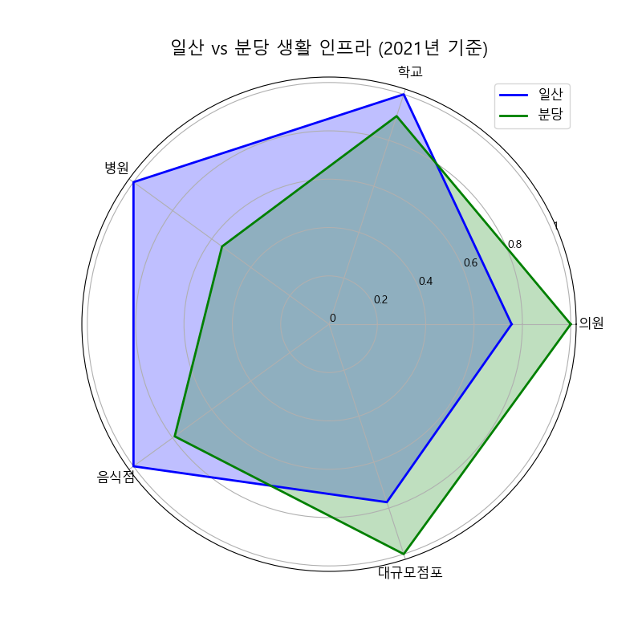
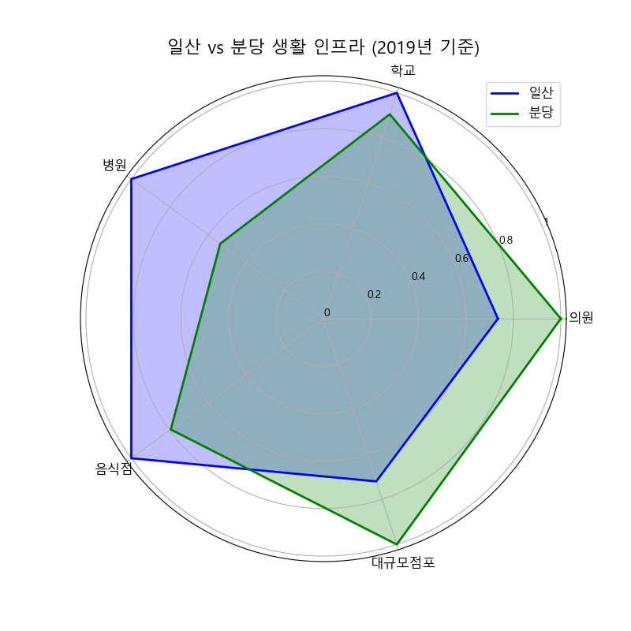
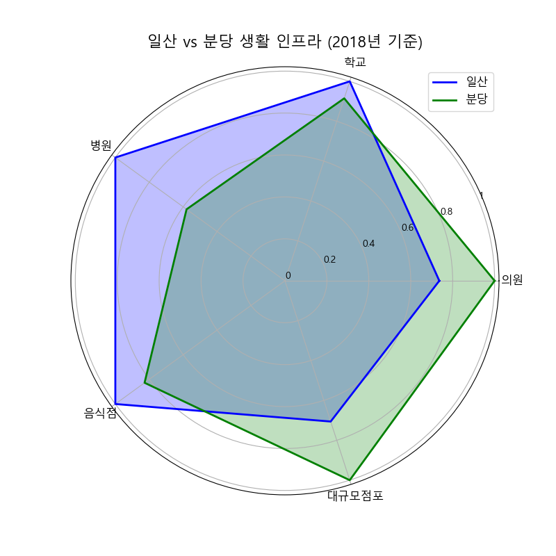
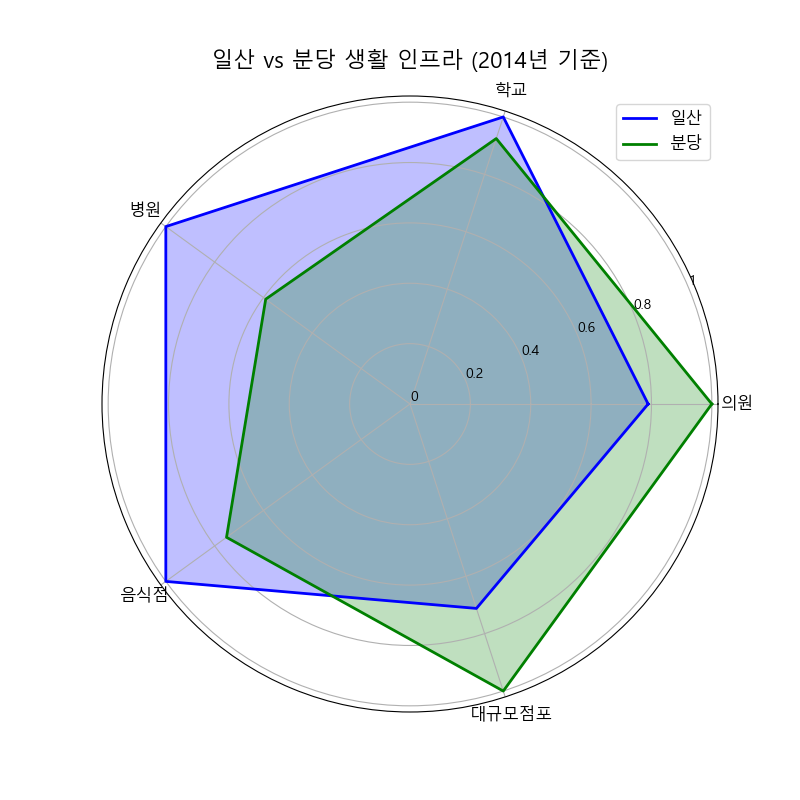
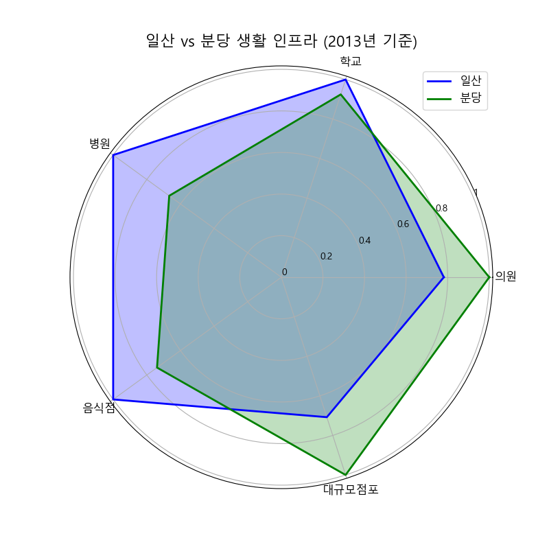
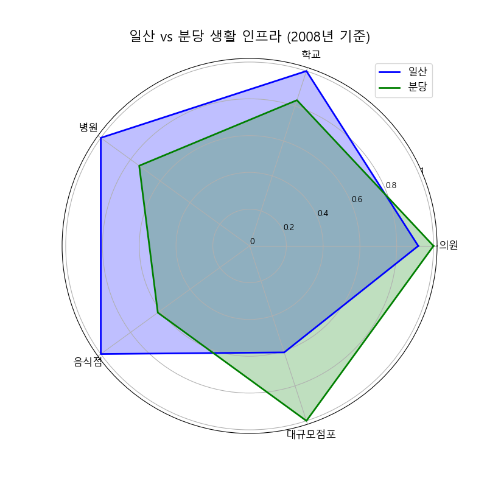
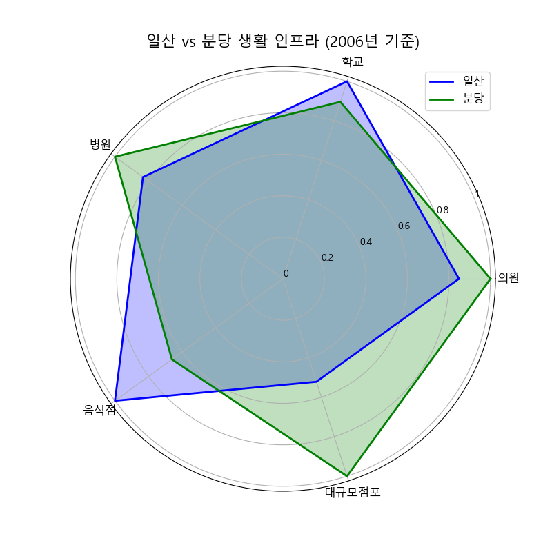

# 생활 인프라 그래프

## 2024 11월 기준

일산 시장 데이터 (241231 기준): 56개  
일산 대규모점포 데이터 (241231 기준): 49개  
일산 음식점 데이터 (241231 기준): 7054개  
일산 병원 데이터 (241231 기준): 51개  
일산 학교 데이터 (241231 기준): 96개  
일산 공원 데이터 (241231 기준): 137개  
일산 의원 데이터 (241231 기준): 738개  

분당 시장 데이터 (241231 기준): 89개  
분당 대규모점포 데이터 (241231 기준): 61개  
분당 음식점 데이터 (241231 기준): 4639개  
분당 병원 데이터 (241231 기준): 27개  
분당 학교 데이터 (241231 기준): 88개  
분당 공원 데이터 (241231 기준): 136개  
분당 의원 데이터 (241231 기준): 1021개  

## 2023년도 기준

일산 대규모점포 데이터 (231231 기준): 49개  
일산 음식점 데이터 (231231 기준): 7054개  
일산 병원 데이터 (231231 기준): 50개  
일산 학교 데이터 (231231 기준): 95개  
일산 의원 데이터 (231231 기준): 728개  

분당 대규모점포 데이터 (231231 기준): 61개  
분당 음식점 데이터 (231231 기준): 4609개  
분당 병원 데이터 (231231 기준): 27개  
분당 학교 데이터 (231231 기준): 88개  
분당 의원 데이터 (231231 기준): 997개  

## 2022년도 기준

일산 대규모점포 데이터 (221231 기준): 49개  
일산 음식점 데이터 (221231 기준): 7086개  
일산 병원 데이터 (221231 기준): 52개  
일산 학교 데이터 (221231 기준): 95개  
일산 의원 데이터 (221231 기준): 723개  

분당 대규모점포 데이터 (221231 기준): 60개  
분당 음식점 데이터 (221231 기준): 4470개  
분당 병원 데이터 (221231 기준): 29개  
분당 학교 데이터 (221231 기준): 88개  
분당 의원 데이터 (221231 기준): 963개  

## 2021년도 기준

일산 대규모점포 데이터 (211231 기준): 48개  
일산 음식점 데이터 (211231 기준): 7749개  
일산 병원 데이터 (211231 기준): 52개  
일산 학교 데이터 (211231 기준): 95개  
일산 의원 데이터 (211231 기준): 714개  

분당 대규모점포 데이터 (211231 기준): 62개  
분당 음식점 데이터 (211231 기준): 4483개  
분당 병원 데이터 (211231 기준): 29개  
분당 학교 데이터 (211231 기준): 88개  
분당 의원 데이터 (211231 기준): 940개  

## 2020년도 기준

일산 대규모점포 데이터 (201231 기준): 48개  
일산 음식점 데이터 (201231 기준): 8369개  
일산 병원 데이터 (201231 기준): 53개  
일산 학교 데이터 (201231 기준): 95개  
일산 의원 데이터 (201231 기준): 698개  

분당 대규모점포 데이터 (201231 기준): 62개  
분당 음식점 데이터 (201231 기준): 4473개  
분당 병원 데이터 (201231 기준): 29개  
분당 학교 데이터 (201231 기준): 86개  
분당 의원 데이터 (201231 기준): 924개  

## 2019년도 기준

일산 대규모점포 데이터 (191231 기준): 49개  
일산 음식점 데이터 (191231 기준): 8975개  
일산 병원 데이터 (191231 기준): 54개  
일산 학교 데이터 (191231 기준): 95개  
일산 의원 데이터 (191231 기준): 675개  

분당 대규모점포 데이터 (191231 기준): 68개  
분당 음식점 데이터 (191231 기준): 4387개  
분당 병원 데이터 (191231 기준): 29개  
분당 학교 데이터 (191231 기준): 86개  
분당 의원 데이터 (191231 기준): 918개  

## 2018년도 기준

일산 대규모점포 데이터 (181231 기준): 48개  
일산 음식점 데이터 (181231 기준): 9656개  
일산 병원 데이터 (181231 기준): 50개  
일산 학교 데이터 (181231 기준): 94개  
일산 의원 데이터 (181231 기준): 670개  

분당 대규모점포 데이터 (181231 기준): 68개  
분당 음식점 데이터 (181231 기준): 4537개  
분당 병원 데이터 (181231 기준): 29개  
분당 학교 데이터 (181231 기준): 86개  
분당 의원 데이터 (181231 기준): 910개  

## 2017년도 기준

일산 대규모점포 데이터 (171231 기준): 48개  
일산 음식점 데이터 (171231 기준): 10741개  
일산 병원 데이터 (171231 기준): 51개  
일산 학교 데이터 (171231 기준): 94개  
일산 의원 데이터 (171231 기준): 662개  

분당 대규모점포 데이터 (171231 기준): 68개  
분당 음식점 데이터 (171231 기준): 4563개  
분당 병원 데이터 (171231 기준): 29개  
분당 학교 데이터 (171231 기준): 86개  
분당 의원 데이터 (171231 기준): 877개  

## 2016년도 기준

일산 대규모점포 데이터 (161231 기준): 48개  
일산 음식점 데이터 (161231 기준): 11290개  
일산 병원 데이터 (161231 기준): 49개  
일산 학교 데이터 (161231 기준): 93개  
일산 의원 데이터 (161231 기준): 661개  

분당 대규모점포 데이터 (161231 기준): 69개  
분당 음식점 데이터 (161231 기준): 4524개  
분당 병원 데이터 (161231 기준): 28개  
분당 학교 데이터 (161231 기준): 86개  
분당 의원 데이터 (161231 기준): 865개  

## 2015년도 기준

일산 대규모점포 데이터 (151231 기준): 47개  
일산 음식점 데이터 (151231 기준): 12121개  
일산 병원 데이터 (151231 기준): 46개  
일산 학교 데이터 (151231 기준): 93개  
일산 의원 데이터 (151231 기준): 664개  

분당 대규모점포 데이터 (151231 기준): 67개  
분당 음식점 데이터 (151231 기준): 4506개  
분당 병원 데이터 (151231 기준): 27개  
분당 학교 데이터 (151231 기준): 86개  
분당 의원 데이터 (151231 기준): 841개  

## 2014년도 기준

일산 대규모점포 데이터 (141231 기준): 47개  
일산 음식점 데이터 (141231 기준): 12579개  
일산 병원 데이터 (141231 기준): 44개  
일산 학교 데이터 (141231 기준): 93개  
일산 의원 데이터 (141231 기준): 643개  

분당 대규모점포 데이터 (141231 기준): 66개  
분당 음식점 데이터 (141231 기준): 4352개  
분당 병원 데이터 (141231 기준): 26개  
분당 학교 데이터 (141231 기준): 86개  
분당 의원 데이터 (141231 기준): 815개  

## 2013년도 기준

일산 대규모점포 데이터 (131231 기준): 46개  
일산 음식점 데이터 (131231 기준): 13061개  
일산 병원 데이터 (131231 기준): 42개  
일산 학교 데이터 (131231 기준): 93개  
일산 의원 데이터 (131231 기준): 622개  

분당 대규모점포 데이터 (131231 기준): 65개  
분당 음식점 데이터 (131231 기준): 4170개  
분당 병원 데이터 (131231 기준): 28개  
분당 학교 데이터 (131231 기준): 86개  
분당 의원 데이터 (131231 기준): 796개  

## 2012년도 기준

일산 대규모점포 데이터 (121231 기준): 42개  
일산 음식점 데이터 (121231 기준): 13592개  
일산 병원 데이터 (121231 기준): 40개  
일산 학교 데이터 (121231 기준): 93개  
일산 의원 데이터 (121231 기준): 625개  

분당 대규모점포 데이터 (121231 기준): 61개  
분당 음식점 데이터 (121231 기준): 3943개  
분당 병원 데이터 (121231 기준): 27개  
분당 학교 데이터 (121231 기준): 85개  
분당 의원 데이터 (121231 기준): 775개  

## 2011년 기준

일산 대규모점포 데이터 (111231 기준): 32개  
일산 음식점 데이터 (111231 기준): 14062개  
일산 병원 데이터 (111231 기준): 36개  
일산 학교 데이터 (111231 기준): 91개  
일산 의원 데이터 (111231 기준): 611개  

분당 대규모점포 데이터 (111231 기준): 54개  
분당 음식점 데이터 (111231 기준): 3768개  
분당 병원 데이터 (111231 기준): 25개  
분당 학교 데이터 (111231 기준): 85개  
분당 의원 데이터 (111231 기준): 735개  

## 2010년 기준

일산 시장 데이터 (101231 기준): 56개  
일산 대규모점포 데이터 (101231 기준): 31개  
일산 음식점 데이터 (101231 기준): 14698개  
일산 병원 데이터 (101231 기준): 37개  
일산 학교 데이터 (101231 기준): 86개  
일산 공원 데이터 (101231 기준): 137개  
일산 의원 데이터 (101231 기준): 600개  

분당 시장 데���터 (101231 기준): 89개  
분당 대규모점포 데이터 (101231 기준): 49개  
분당 음식점 데이터 (101231 기준): 3603개  
분당 병원 데이터 (101231 기준): 25개  
분당 학교 데이터 (101231 기준): 84개  
분당 공원 데이터 (101231 기준): 136개  
분당 의원 데이터 (101231 기준): 692개  

## 2009년 기준

일산 대규모점포 데이터 (091231 기준): 28개  
일산 음식점 데이터 (091231 기준): 15262개  
일산 병원 데이터 (091231 기준): 37개  
일산 학교 데이터 (091231 기준): 84개  
일산 의원 데이터 (091231 기준): 598개  

분당 대규모점포 데이터 (091231 기준): 47개  
분당 음식점 데이터 (091231 기준): 3462개  
분당 병원 데이터 (091231 기준): 24개  
분당 학교 데이터 (091231 기준): 78개  
분당 의원 데이터 (091231 기준): 660개  

## 2008년도 기준

일산 대규모점포 데이터 (081231 기준): 28개  
일산 음식점 데이터 (081231 기준): 16112개  
일산 병원 데이터 (081231 기준): 31개  
일산 학교 데이터 (081231 기준): 84개  
일산 의원 데이터 (081231 기준): 598개  

분당 대규모점포 데이터 (081231 기준): 46개  
분당 음식점 데이터 (081231 기준): 3370개  
분당 병원 데이터 (081231 기준): 23개  
분당 학교 데이터 (081231 기준): 70개  
분당 의원 데이터 (081231 기준): 652개  

## 2007년도 기준

일산 대규모점포 데이터 (071231 기준): 27개  
일산 음식점 데이터 (071231 기준): 16687개  
일산 병원 데이터 (071231 기준): 28개  
일산 학교 데이터 (071231 기준): 78개  
일산 의원 데이터 (071231 기준): 579개  

분당 대규모점포 데이터 (071231 기준): 46개  
분당 음식점 데이터 (071231 기준): 3491개  
분당 병원 데이터 (071231 기준): 25개  
분당 학교 데이터 (071231 기준): 69개  
분당 의원 데이터 (071231 기준): 635개  

## 2006년도 기준

일산 대규모점포 데이터 (061231 기준): 24개  
일산 음식점 데이터 (061231 기준): 17329개  
일산 병원 데이터 (061231 기준): 20개  
일산 학교 데이터 (061231 기준): 77개  
일산 의원 데이터 (061231 기준): 520개  

분당 대규모점포 데이터 (061231 기준): 46개  
분당 음식점 데이터 (061231 기준): 3467개  
분당 병원 데이터 (061231 기준): 24개  
분당 학교 데이터 (061231 기준): 69개  
분당 의원 데이터 (061231 기준): 613개  

