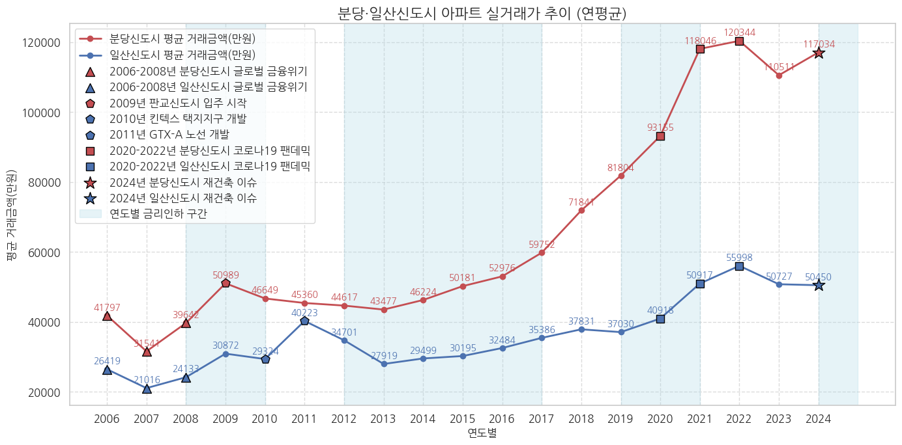

# 아파트 실거래가 데이터
* 데이터 기간: 2006년 1월 ~ 2024년 11월

## 경기도 성남시 (87087, 6)

| 시군구                      | 번지 | 단지명                | 전용면적(㎡) | 계약년월 | 거래금액(만원) |
| --------------------------- | ---- | --------------------- | ------------ | -------- | -------------- |
| 경기도 성남시 분당구 정자동 | 180  | 미켈란쉐르빌          | 21.290       | 202312   | 29500          |
| 경기도 성남시 분당구 수내동 | 36   | 양지마을(2단지)(청구) | 84.600       | 202312   | 154000         |
| 경기도 성남시 분당구 정자동 | 10-1 | 현대I-PARK2           | 162.010      | 202312   | 203000         |
| 경기도 성남시 분당구 서현동 | 91   | 시범한양              | 28.710       | 202312   | 55000          |
| 경기도 성남시 분당구 서현동 | 87   | 시범삼성              | 59.995       | 202312   | 115000         |

## 경기도 성남시 시각화

## 경기도 고양시 (124269, 6)

| 시군구                        | 번지   | 단지명                | 전용면적(㎡) | 계약년월 | 거래금액(만원) |
| ----------------------------- | ------ | --------------------- | ------------ | -------- | -------------- |
| 경기도 고양시 일산서구 주엽동 | 136    | 문촌마을13단지대우    | 74.460       | 202312   | 39300          |
| 경기도 고양시 일산동구 중산동 | 1575-4 | 중산마을11(현대)      | 84.360       | 202312   | 30500          |
| 경기도 고양시 일산서구 탄현동 | 121    | 큰마을대림,현대아파트 | 59.820       | 202312   | 26100          |
| 경기도 고양시 일산서구 주엽동 | 135    | 문촌마을15단지부영    | 40.270       | 202312   | 28800          |
| 경기도 고양시 일산서구 일산동 | 2125   | 신원1                 | 84.961       | 202312   | 34000          |

## 경기도 고양시 시각화

## 종합 + 판교신도시(α)

