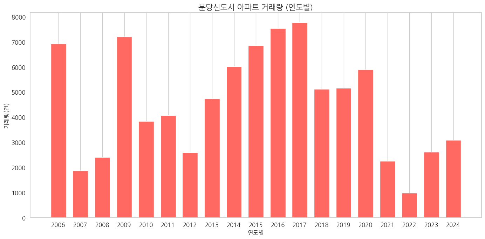

# 아파트 실거래가 데이터
* 데이터 기간: 2006년 1월 ~ 2024년 11월

## 경기도 성남시 데이터 형태 (87087, 6)

| 시군구                      | 번지 | 단지명                | 전용면적(㎡) | 계약년월 | 거래금액(만원) |
| --------------------------- | ---- | --------------------- | ------------ | -------- | -------------- |
| 경기도 성남시 분당구 정자동 | 180  | 미켈란쉐르빌          | 21.290       | 202312   | 29500          |
| 경기도 성남시 분당구 수내동 | 36   | 양지마을(2단지)(청구) | 84.600       | 202312   | 154000         |
| 경기도 성남시 분당구 정자동 | 10-1 | 현대I-PARK2           | 162.010      | 202312   | 203000         |
| 경기도 성남시 분당구 서현동 | 91   | 시범한양              | 28.710       | 202312   | 55000          |
| 경기도 성남시 분당구 서현동 | 87   | 시범삼성              | 59.995       | 202312   | 115000         |

## 경기도 성남시 시각화 (분당신도시)

## 경기도 고양시 데이터 형태 (124269, 6)

| 시군구                        | 번지   | 단지명                | 전용면적(㎡) | 계약년월 | 거래금액(만원) |
| ----------------------------- | ------ | --------------------- | ------------ | -------- | -------------- |
| 경기도 고양시 일산서구 주엽동 | 136    | 문촌마을13단지대우    | 74.460       | 202312   | 39300          |
| 경기도 고양시 일산동구 중산동 | 1575-4 | 중산마을11(현대)      | 84.360       | 202312   | 30500          |
| 경기도 고양시 일산서구 탄현동 | 121    | 큰마을대림,현대아파트 | 59.820       | 202312   | 26100          |
| 경기도 고양시 일산서구 주엽동 | 135    | 문촌마을15단지부영    | 40.270       | 202312   | 28800          |
| 경기도 고양시 일산서구 일산동 | 2125   | 신원1                 | 84.961       | 202312   | 34000          |

## 경기도 고양시 시각화 (일산신도시)

## 종합 시각화 (분당신도시, 일산신도시)

* 2008~2009년 금융위기: 글로벌 금융위기 영향으로 전반적인 부동산 시장 침체
* 2015~2021년 급등기: 분당은 교통 인프라 확충(신분당선, GTX-A)과 IT 산업 집중 가격 급등
* 2011년 일산신도시 아파트 가격 상승에 영향을 미친 주요 인프라 확충 요인
  * GTX-A 노선 개발: 2011년경 수도권광역급행철도(GTX) A노선의 일산~동탄 구간 개발이 확정되었습니다. 이 노선은 서울 강남(삼성역)까지 약 20분 만에 도착할 수 있어 서울 접근성이 크게 개선될 예정이었고, 이는 일산신도시의 주거 매력을 높여 부동산 가격 상승에 기여한 중요한 요인 중 하나였습니다.
  * 킨텍스 택지지구 개발: 2010년대 초반부터 킨텍스 주변 지역이 대규모로 개발되기 시작했습니다. 킨텍스 제2전시장 개장(2010년)과 함께 상업 및 주거 단지들이 조성되면서 일산신도시의 상권이 활성화되었고, 이는 아파트 가격 상승에 긍정적인 영향을 미쳤습니다.
  * 한류월드 개발: 한류 콘텐츠와 관련된 복합단지인 한류월드 사업이 2012년에 재개되면서, 이 지역이 관광 및 문화 중심지로 성장할 가능성이 높아졌습니다. 이러한 개발 호재는 일산신도시의 부동산 시장에도 긍정적인 영향을 미쳤습니다.
* 2022년 이후 조정기: 정부의 부동산 규제 강화와 금리 인상 등의 영향으로 전반적인 가격 조정
  
