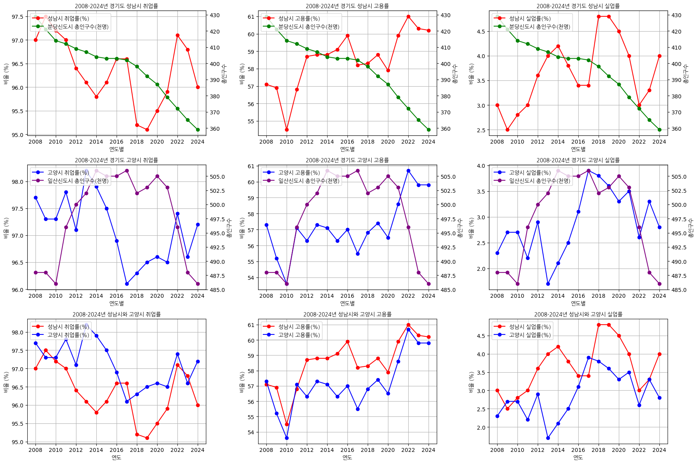
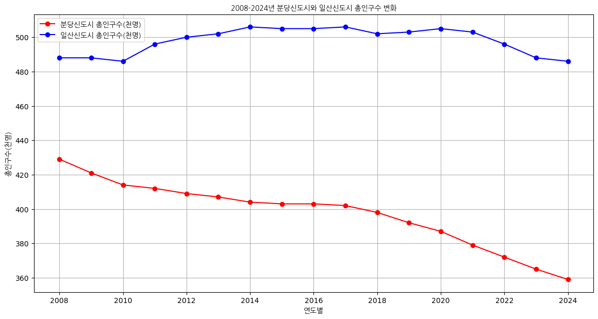
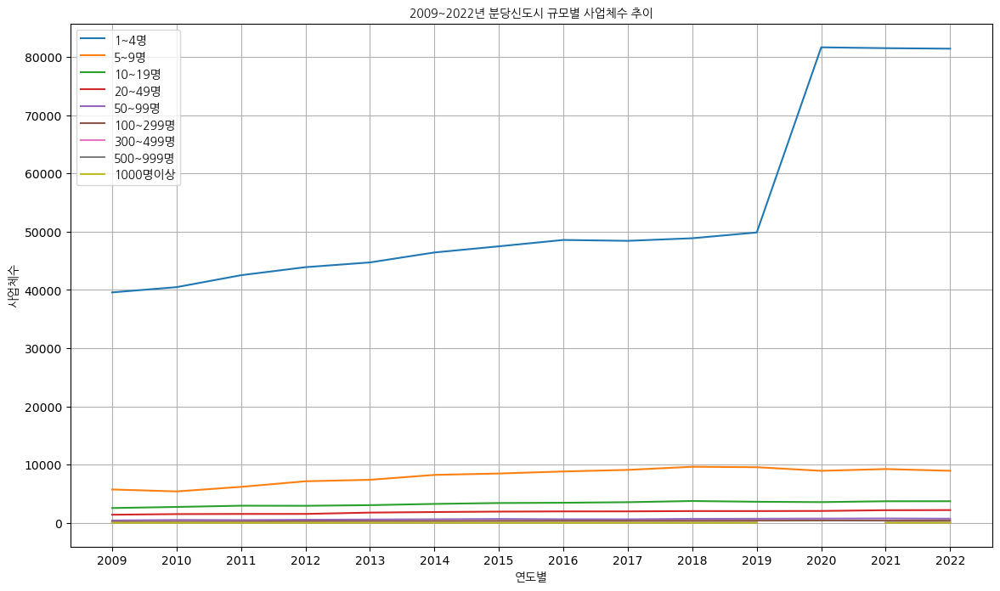
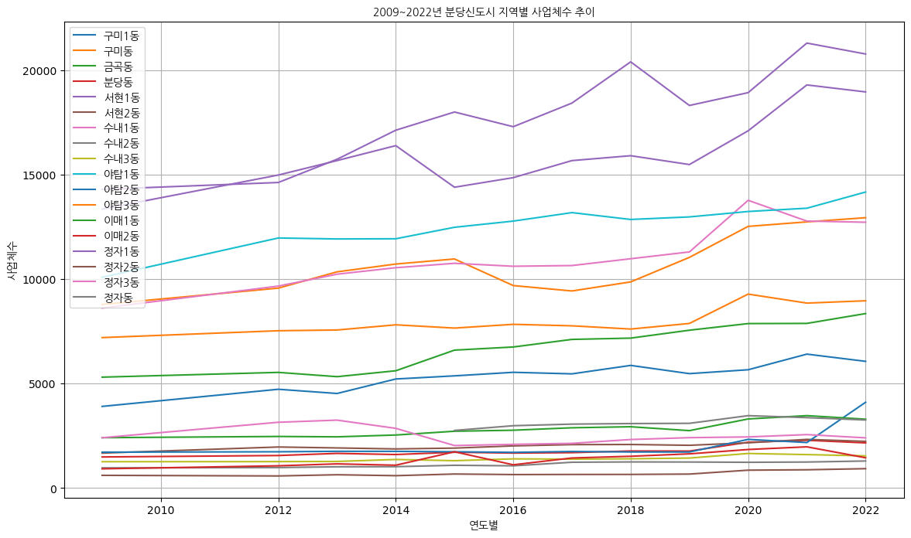
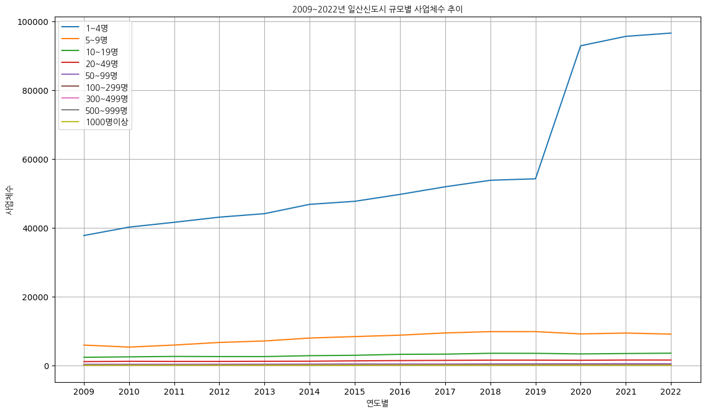
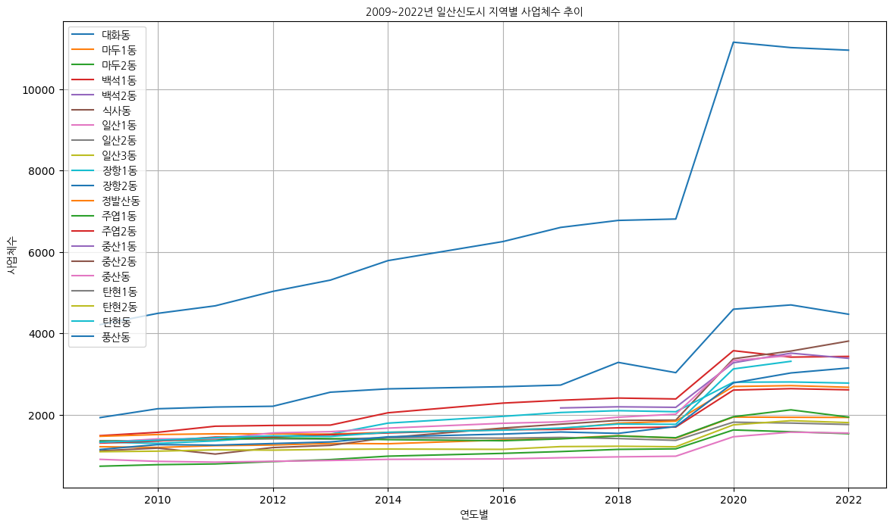

# 경기도 성남시 취업률 / 고용률 / 실업률 (17, 11)

|     | 행정구역별 | 연도 | 총 인구수(천명) | 15세이상인구 (천명) | 경제활동인구 (천명) | 취업자 (천명) | 실업자 (천명) | 비경제활동인구 (천명) | 고용률 (%) | 실업률 (％) | 취업률(%) | 고용률(%) | 실업률(％) |
| --- | ---------- | ---- | --------------- | ------------------- | ------------------- | ------------- | ------------- | --------------------- | ---------- | ----------- | --------- | --------- | ---------- |
| 0   | 성남시     | 2008 | 429             | 760.6               | 448.1               | 434.5         | 13.6          | 312.5                 | 57.1       | 3.0         | 97.0      | 57.1      | 3.0        |
| 1   | 성남시     | 2009 | 421             | 774.2               | 452.0               | 440.6         | 11.4          | 322.1                 | 56.9       | 2.5         | 97.5      | 56.9      | 2.5        |
| 2   | 성남시     | 2010 | 414             | 1579.7              | 885.7               | 860.6         | 25.1          | 694.1                 | 108.9      | 5.7         | 97.2      | 54.5      | 2.8        |
| 3   | 성남시     | 2011 | 412             | 3180.5              | 1862.3              | 1807.1        | 55.3          | 1318.1                | 227.3      | 11.9        | 97.0      | 56.8      | 3.0        |
| 4   | 성남시     | 2012 | 409             | 3193.3              | 1943.3              | 1873.5        | 69.8          | 1250.0                | 234.7      | 14.5        | 96.4      | 58.7      | 3.6        |
| 5   | 성남시     | 2013 | 407             | 1610.0              | 984.0               | 946.0         | 39.0          | 625.0                 | 117.5      | 7.8         | 96.1      | 58.8      | 4.0        |
| 6   | 성남시     | 2014 | 404             | 1618.0              | 993.0               | 951.0         | 42.0          | 626.0                 | 117.4      | 8.5         | 95.8      | 58.8      | 4.2        |
| 7   | 성남시     | 2015 | 403             | 1620.0              | 997.0               | 958.0         | 38.0          | 624.0                 | 118.3      | 7.6         | 96.1      | 59.1      | 3.8        |
| 8   | 성남시     | 2016 | 403             | 1632.0              | 1011.0              | 977.0         | 34.0          | 621.0                 | 119.8      | 6.7         | 96.6      | 59.9      | 3.4        |
| 9   | 성남시     | 2017 | 402             | 1623.0              | 977.0               | 944.0         | 33.0          | 647.0                 | 116.4      | 6.7         | 96.6      | 58.2      | 3.4        |
| 10  | 성남시     | 2018 | 398             | 1609.0              | 985.0               | 938.0         | 47.0          | 623.0                 | 116.7      | 9.5         | 95.2      | 58.3      | 4.8        |
| 11  | 성남시     | 2019 | 392             | 1600.0              | 989.0               | 941.0         | 47.0          | 613.0                 | 117.7      | 9.5         | 95.1      | 58.8      | 4.8        |
| 12  | 성남시     | 2020 | 387             | 1597.0              | 969.0               | 925.0         | 44.0          | 627.0                 | 115.9      | 9.1         | 95.5      | 57.9      | 4.5        |
| 13  | 성남시     | 2021 | 379             | 1597.0              | 997.0               | 956.0         | 40.0          | 601.0                 | 119.7      | 8.1         | 95.9      | 59.9      | 4.0        |
| 14  | 성남시     | 2022 | 372             | 1601.0              | 1006.0              | 977.0         | 30.0          | 594.0                 | 122.0      | 5.9         | 97.1      | 61.0      | 3.0        |
| 15  | 성남시     | 2023 | 365             | 1590.0              | 991.0               | 959.0         | 33.0          | 598.0                 | 120.6      | 6.6         | 96.8      | 60.3      | 3.3        |
| 16  | 성남시     | 2024 | 359             | 797.0               | 500.0               | 480.0         | 20.0          | 297.0                 | 60.2       | 4.1         | 96.0      | 60.2      | 4.0        |

# 경기도 고양시 취업률 / 고용률 / 실업률 (17, 11)

|     | 행정구역별 | 연도 | 총 인구수(천명) | 15세이상인구 (천명) | 경제활동인구 (천명) | 취업자 (천명) | 실업자 (천명) | 비경제활동인구 (천명) | 고용률 (%) | 실업률 (％) | 취업률(%) | 고용률(%) | 실업률(％) |
| --- | ---------- | ---- | --------------- | ------------------- | ------------------- | ------------- | ------------- | --------------------- | ---------- | ----------- | --------- | --------- | ---------- |
| 0   | 고양시     | 2008 | 488             | 714.9               | 419.0               | 409.3         | 9.7           | 295.9                 | 57.2       | 2.3         | 97.7      | 57.3      | 2.3        |
| 1   | 고양시     | 2009 | 488             | 726.0               | 412.1               | 401.0         | 11.1          | 314.0                 | 55.2       | 2.7         | 97.3      | 55.2      | 2.7        |
| 2   | 고양시     | 2010 | 486             | 1471.6              | 810.7               | 788.5         | 22.1          | 661.0                 | 107.1      | 5.5         | 97.3      | 53.6      | 2.7        |
| 3   | 고양시     | 2011 | 496             | 2987.1              | 1743.1              | 1705.1        | 38.2          | 1244.1                | 228.3      | 8.7         | 97.8      | 57.1      | 2.2        |
| 4   | 고양시     | 2012 | 500             | 3035.8              | 1759.7              | 1708.0        | 51.7          | 1276.1                | 225.0      | 11.8        | 97.1      | 56.3      | 2.9        |
| 5   | 고양시     | 2013 | 502             | 1555.0              | 907.0               | 891.0         | 15.0          | 648.0                 | 114.7      | 3.4         | 98.2      | 57.3      | 1.7        |
| 6   | 고양시     | 2014 | 506             | 1605.0              | 936.0               | 916.0         | 20.0          | 670.0                 | 114.1      | 4.2         | 97.9      | 57.1      | 2.1        |
| 7   | 고양시     | 2015 | 505             | 1647.0              | 952.0               | 928.0         | 24.0          | 695.0                 | 112.7      | 5.1         | 97.5      | 56.3      | 2.5        |
| 8   | 고양시     | 2016 | 505             | 1676.0              | 986.0               | 955.0         | 31.0          | 690.0                 | 113.9      | 6.4         | 96.9      | 57.0      | 3.1        |
| 9   | 고양시     | 2017 | 506             | 1700.0              | 982.0               | 944.0         | 38.0          | 718.0                 | 111.1      | 7.7         | 96.1      | 55.5      | 3.9        |
| 10  | 고양시     | 2018 | 502             | 1708.0              | 1007.0              | 970.0         | 38.0          | 701.0                 | 113.5      | 7.5         | 96.3      | 56.8      | 3.8        |
| 11  | 고양시     | 2019 | 503             | 1743.0              | 1036.0              | 1000.0        | 37.0          | 708.0                 | 114.6      | 7.1         | 96.5      | 57.4      | 3.6        |
| 12  | 고양시     | 2020 | 505             | 1793.0              | 1049.0              | 1013.0        | 35.0          | 744.0                 | 113.0      | 6.7         | 96.6      | 56.5      | 3.3        |
| 13  | 고양시     | 2021 | 503             | 1824.0              | 1108.0              | 1069.0        | 39.0          | 717.0                 | 117.1      | 7.0         | 96.5      | 58.6      | 3.5        |
| 14  | 고양시     | 2022 | 496             | 1840.0              | 1147.0              | 1117.0        | 30.0          | 694.0                 | 121.4      | 5.1         | 97.4      | 60.7      | 2.6        |
| 15  | 고양시     | 2023 | 488             | 1839.0              | 1139.0              | 1100.0        | 38.0          | 699.0                 | 119.7      | 6.8         | 96.6      | 59.8      | 3.3        |
| 16  | 고양시     | 2024 | 486             | 918.0               | 565.0               | 549.0         | 16.0          | 353.0                 | 59.8       | 2.8         | 97.2      | 59.8      | 2.8        |

# 종합 시각화 (취업률, 고용률, 실업률)

# 분당신도시, 일산신도시 총인구수 변화

* 분당신도시 월별 인구수

| 연도 | 1월      | 2월      | 3월      | 4월      | 5월      | 6월      | 7월      | 8월      | 9월      | 10월     | 11월     | 12월     |
| ---- | -------- | -------- | -------- | -------- | -------- | -------- | -------- | -------- | -------- | -------- | -------- | -------- |
| 2008 | 431666.0 | 431516.0 | 430439.0 | 429906.0 | 429689.0 | 429418.0 | 429550.0 | 429021.0 | 428592.0 | 427634.0 | 427156.0 | 426782.0 |
| 2009 | 426501.0 | 426420.0 | 424816.0 | 424049.0 | 423606.0 | 422243.0 | 421455.0 | 419676.0 | 418859.0 | 417742.0 | 416746.0 | 416401.0 |
| 2010 | 415827.0 | 415542.0 | 415284.0 | 415124.0 | 415147.0 | 414969.0 | 414175.0 | 413340.0 | 412949.0 | 414727.0 | 414415.0 | 414367.0 |
| 2011 | 414522.0 | 414643.0 | 414006.0 | 413630.0 | 412931.0 | 412447.0 | 411961.0 | 411071.0 | 410705.0 | 410520.0 | 410627.0 | 410180.0 |
| 2012 | 410304.0 | 410121.0 | 409786.0 | 409616.0 | 409487.0 | 409245.0 | 409326.0 | 409130.0 | 409067.0 | 408952.0 | 408867.0 | 409012.0 |
| 2013 | 408837.0 | 408649.0 | 408068.0 | 407573.0 | 407367.0 | 407383.0 | 407425.0 | 407344.0 | 406909.0 | 406033.0 | 405675.0 | 405564.0 |
| 2014 | 405710.0 | 405661.0 | 405306.0 | 404986.0 | 405001.0 | 404641.0 | 404109.0 | 403822.0 | 403517.0 | 403183.0 | 403053.0 | 403231.0 |
| 2015 | 403530.0 | 403765.0 | 403574.0 | 403289.0 | 403244.0 | 403424.0 | 403722.0 | 404045.0 | 404140.0 | 403983.0 | 403715.0 | 403758.0 |
| 2016 | 404119.0 | 404054.0 | 403734.0 | 403581.0 | 403606.0 | 403499.0 | 403346.0 | 403027.0 | 403074.0 | 403200.0 | 402897.0 | 402956.0 |
| 2017 | 402979.0 | 403174.0 | 402659.0 | 402708.0 | 403009.0 | 403015.0 | 402626.0 | 402198.0 | 401652.0 | 401178.0 | 400636.0 | 400491.0 |
| 2018 | 400425.0 | 400166.0 | 399546.0 | 399031.0 | 398815.0 | 398643.0 | 398129.0 | 397417.0 | 396786.0 | 396086.0 | 395661.0 | 395532.0 |
| 2019 | 395308.0 | 394800.0 | 394134.0 | 393332.0 | 392918.0 | 392538.0 | 391983.0 | 391127.0 | 390404.0 | 389701.0 | 389436.0 | 389601.0 |
| 2020 | 389676.0 | 389554.0 | 389177.0 | 389044.0 | 388494.0 | 388078.0 | 387471.0 | 386377.0 | 385536.0 | 384797.0 | 384421.0 | 384081.0 |
| 2021 | 383989.0 | 383522.0 | 382322.0 | 381539.0 | 381025.0 | 379651.0 | 377782.0 | 377025.0 | 376589.0 | 376064.0 | 375849.0 | 375501.0 |
| 2022 | 375096.0 | 374888.0 | 374241.0 | 373804.0 | 373494.0 | 373256.0 | 373101.0 | 372838.0 | 371666.0 | 371237.0 | 371008.0 | 370481.0 |
| 2023 | 370283.0 | 369656.0 | 368768.0 | 367829.0 | 367022.0 | 365905.0 | 364562.0 | 363194.0 | 362516.0 | 362258.0 | 361848.0 | 361102.0 |
| 2024 | 360887.0 | 360542.0 | 360075.0 | 359629.0 | 359203.0 | 359019.0 | 358850.0 | 358701.0 | 358411.0 | 357902.0 | 0.0      | 0.0      |

* 일산신도시 월별 인구수
 
| 연도 | 1월      | 2월      | 3월      | 4월      | 5월      | 6월      | 7월      | 8월      | 9월      | 10월     | 11월     | 12월     |
| ---- | -------- | -------- | -------- | -------- | -------- | -------- | -------- | -------- | -------- | -------- | -------- | -------- |
| 2008 | 486230.0 | 487549.0 | 487958.0 | 488642.0 | 489110.0 | 489190.0 | 489300.0 | 489176.0 | 489117.0 | 489061.0 | 489461.0 | 489511.0 |
| 2009 | 489518.0 | 489608.0 | 488929.0 | 488866.0 | 488755.0 | 488878.0 | 488765.0 | 488588.0 | 488498.0 | 488386.0 | 488529.0 | 487402.0 |
| 2010 | 486995.0 | 486739.0 | 486158.0 | 485825.0 | 485163.0 | 485203.0 | 485083.0 | 484674.0 | 484673.0 | 488736.0 | 490562.0 | 492170.0 |
| 2011 | 493023.0 | 494860.0 | 495526.0 | 496120.0 | 496401.0 | 496835.0 | 496962.0 | 497318.0 | 497548.0 | 498471.0 | 499560.0 | 499356.0 |
| 2012 | 499540.0 | 500122.0 | 500156.0 | 500274.0 | 500582.0 | 500792.0 | 501139.0 | 501290.0 | 501093.0 | 500997.0 | 501457.0 | 501696.0 |
| 2013 | 501876.0 | 501838.0 | 501565.0 | 501495.0 | 501822.0 | 501853.0 | 502175.0 | 503003.0 | 503743.0 | 504539.0 | 505422.0 | 505909.0 |
| 2014 | 506280.0 | 506820.0 | 506864.0 | 506840.0 | 506970.0 | 506576.0 | 506155.0 | 506021.0 | 505791.0 | 505957.0 | 505899.0 | 505699.0 |
| 2015 | 506004.0 | 506200.0 | 506154.0 | 506151.0 | 506388.0 | 506036.0 | 505695.0 | 505580.0 | 505208.0 | 505339.0 | 505327.0 | 505031.0 |
| 2016 | 505077.0 | 504914.0 | 504715.0 | 504759.0 | 504521.0 | 504898.0 | 505610.0 | 506620.0 | 507078.0 | 507323.0 | 507777.0 | 508076.0 |
| 2017 | 508112.0 | 507851.0 | 507631.0 | 507407.0 | 507189.0 | 506940.0 | 506572.0 | 506193.0 | 505569.0 | 505149.0 | 504726.0 | 504280.0 |
| 2018 | 503704.0 | 503131.0 | 502545.0 | 502039.0 | 501459.0 | 502258.0 | 502527.0 | 502238.0 | 501960.0 | 502358.0 | 503241.0 | 503776.0 |
| 2019 | 503939.0 | 503615.0 | 503804.0 | 504299.0 | 504152.0 | 504166.0 | 503635.0 | 502934.0 | 503204.0 | 503982.0 | 504792.0 | 505147.0 |
| 2020 | 505585.0 | 505726.0 | 505832.0 | 506137.0 | 506363.0 | 506588.0 | 506485.0 | 505953.0 | 505416.0 | 505080.0 | 504778.0 | 505364.0 |
| 2021 | 506093.0 | 505996.0 | 504685.0 | 504135.0 | 503849.0 | 503548.0 | 503468.0 | 502827.0 | 502469.0 | 502005.0 | 501009.0 | 500313.0 |
| 2022 | 499732.0 | 499296.0 | 499200.0 | 499020.0 | 498571.0 | 498118.0 | 497701.0 | 496499.0 | 494903.0 | 493898.0 | 493065.0 | 492326.0 |
| 2023 | 491364.0 | 490571.0 | 489554.0 | 489034.0 | 488607.0 | 488346.0 | 487992.0 | 487502.0 | 487108.0 | 486661.0 | 486246.0 | 486325.0 |
| 2024 | 486053.0 | 485794.0 | 485441.0 | 486338.0 | 486996.0 | 487130.0 | 487163.0 | 487205.0 | 486907.0 | 486469.0 | 0.0      | 0.0      |

# 분당신도시, 일산신도시 총인구수 변화 시각화 (연평균)

# 경기도 성남시 사업체 수

| 시점 | 항목       | 전 산업 | 농업 임업 및 어업 (01 ~ 03) | 농업 | 임업 | 광업 (05 ~ 08) | 석탄 원유 및 천연가스 광업 | 비금속광물 광업 연료용 제외 | 광업 지원 서비스업 | ... | 창작 예술 및 여가관련 서비스업 | 스포츠 및 오락관련 서비스업 | 협회 및 단체 수리 및 기타 개인 서비스업(94 ~ 96) | 협회 및 단체 | 수리업 | 기타 개인 서비스업 |
| ---- | ---------- | ------- | --------------------------- | ---- | ---- | -------------- | -------------------------- | --------------------------- | ------------------ | --- | ------------------------------ | --------------------------- | ------------------------------------------------ | ------------ | ------ | ------------------ |
| 2009 | 1~4명      | 39577   | 1                           | 1    | 0    | 1              | 0                          | 0                           | 1                  | ... | 99                             | 1515                        | 5095                                             | 960          | 1039   | 3096               |
| 2009 | 5~9명      | 5742    | 0                           | 0    | 0    | 0              | 0                          | 0                           | 0                  | ... | 10                             | 60                          | 294                                              | 89           | 78     | 127                |
| 2009 | 10~19명    | 2552    | 1                           | 0    | 1    | 1              | 0                          | 1                           | 0                  | ... | 5                              | 18                          | 117                                              | 22           | 34     | 61                 |
| 2009 | 20~49명    | 1407    | 1                           | 1    | 0    | 0              | 0                          | 0                           | 0                  | ... | 7                              | 9                           | 51                                               | 11           | 19     | 21                 |
| 2009 | 50~99명    | 420     | 0                           | 0    | 0    | 1              | 1                          | 0                           | 0                  | ... | 1                              | 5                           | 6                                                | 3            | 1      | 2                  |
| ...  | ...        | ...     | ...                         | ...  | ...  | ...            | ...                        | ...                         | ...                | ... | ...                            | ...                         | ...                                              | ...          | ...    | ...                | ... | ... | ... | ... | ... | ... | ... |
| 2022 | 50~99명    | 731     | 0                           | 0    | 0    | 0              | 0                          | 0                           | 0                  | ... | 82                             | 26                          | 56                                               | 9            | 4      | 5                  |
| 2022 | 100~299명  | 428     | 0                           | 0    | 0    | 0              | 0                          | 0                           | 0                  | ... | 31                             | 20                          | 11                                               | 5            | 2      | 3                  |
| 2022 | 300~499명  | 62      | 0                           | 0    | 0    | 0              | 0                          | 0                           | 0                  | ... | 2                              | 2                           | 0                                                | 0            | 0      | 0                  |
| 2022 | 500~999명  | 47      | 0                           | 0    | 0    | 0              | 0                          | 0                           | 0                  | ... | 1                              | 1                           | 0                                                | 0            | 0      | 0                  |
| 2022 | 1000명이상 | 27      | 0                           | 0    | 0    | 0              | 0                          | 0                           | 0                  | ... | 3                              | 3                           | 0                                                | 0            | 0      | 0                  |

# 분당신도시 사업체 시각화 (규모별, 동별)

# 경기도 고양시 사업체 수

| 시점 | 항목       | 전 산업 | 농업 임업 및 어업 (01 ~ 03) | 제조업 (10 ~ 33) | 전기 가스 증기 및 수도사업 (35 ~ 36) | 하수 · 폐기물 처리 원료재생 및 환경복원업 (37 ~ 39) | 건설업 (41 ~ 42) | 도매 및 소매업(45~47) | 운수업(49~52) | ... | J.정보통신업(58~63) | K.금융 및 보험업(64~66) | L.부동산업(68) | M.전문 과학 및 기술 서비스업(70~73) | N.사업시설 관리 사업 지원 및 임대 서비스업(74~76) | O.공공행정 국방 및 사회보장 행정(84) | P.교육 서비스업(85) | Q.보건업 및 사회복지 서비스업(86~87) | R.예술 스포츠 및 여가관련 서비스업(90~91) | S.협회 및 단체 수리 및 기타 개인 서비스업(94~96) |
| ---- | ---------- | ------- | --------------------------- | ---------------- | ------------------------------------ | --------------------------------------------------- | ---------------- | --------------------- | ------------- | --- | ------------------- | ----------------------- | -------------- | ----------------------------------- | ------------------------------------------------- | ------------------------------------ | ------------------- | ------------------------------------ | ----------------------------------------- | ------------------------------------------------ |
| 2009 | 1~4명      | 37711   | 4                           | 2235             | 0                                    | 11                                                  | 741              | 9569                  | 4348          | ... | 0.0                 | 0.0                     | 0.0            | 0.0                                 | 0.0                                               | 0.0                                  | 0.0                 | 0.0                                  | 0.0                                       | 0.0                                              |
| 2009 | 5~9명      | 5895    | 1                           | 958              | 0                                    | 18                                                  | 310              | 1241                  | 119           | ... | 0.0                 | 0.0                     | 0.0            | 0.0                                 | 0.0                                               | 0.0                                  | 0.0                 | 0.0                                  | 0.0                                       | 0.0                                              |
| 2009 | 10~19명    | 2347    | 2                           | 422              | 1                                    | 12                                                  | 184              | 408                   | 73            | ... | 0.0                 | 0.0                     | 0.0            | 0.0                                 | 0.0                                               | 0.0                                  | 0.0                 | 0.0                                  | 0.0                                       | 0.0                                              |
| 2009 | 20~49명    | 1096    | 2                           | 179              | 1                                    | 13                                                  | 80               | 152                   | 50            | ... | 0.0                 | 0.0                     | 0.0            | 0.0                                 | 0.0                                               | 0.0                                  | 0.0                 | 0.0                                  | 0.0                                       | 0.0                                              |
| 2009 | 50~99명    | 314     | 0                           | 24               | 4                                    | 0                                                   | 20               | 22                    | 14            | ... | 0.0                 | 0.0                     | 0.0            | 0.0                                 | 0.0                                               | 0.0                                  | 0.0                 | 0.0                                  | 0.0                                       | 0.0                                              |
| ...  | ...        | ...     | ...                         | ...              | ...                                  | ...                                                 | ...              | ...                   | ...           | ... | ...                 | ...                     | ...            | ...                                 | ...                                               | ...                                  | ...                 | ...                                  | ...                                       | ...                                              |
| 2022 | 50~99명    | 472     | 0                           | 0                | 0                                    | 0                                                   | 0                | 0                     | 0             | ... | 9.0                 | 27.0                    | 4.0            | 22.0                                | 24.0                                              | 9.0                                  | 115.0               | 111.0                                | 15.0                                      | 7.0                                              |
| 2022 | 100~299명  | 183     | 0                           | 0                | 0                                    | 0                                                   | 0                | 0                     | 0             | ... | 7.0                 | 4.0                     | 1.0            | 5.0                                 | 15.0                                              | 6.0                                  | 34.0                | 31.0                                 | 6.0                                       | 2.0                                              |
| 2022 | 300~499명  | 24      | 0                           | 0                | 0                                    | 0                                                   | 0                | 0                     | 0             | ... | 2.0                 | 0.0                     | 0.0            | 0.0                                 | 6.0                                               | 7.0                                  | 2.0                 | 2.0                                  | 0.0                                       | 0.0                                              |
| 2022 | 500~999명  | 9       | 0                           | 0                | 0                                    | 0                                                   | 0                | 0                     | 0             | ... | 1.0                 | 0.0                     | 0.0            | 1.0                                 | 2.0                                               | 1.0                                  | 0.0                 | 1.0                                  | 0.0                                       | 0.0                                              |
| 2022 | 1000명이상 | 8       | 0                           | 0                | 0                                    | 0                                                   | 0                | 0                     | 0             | ... | 0.0                 | 0.0                     | 0.0            | 0.0                                 | 0.0                                               | 1.0                                  | 0.0                 | 5.0                                  | 0.0                                       | 0.0                                              |

# 일산신도시 사업체 시각화 (규모별, 동별)

*